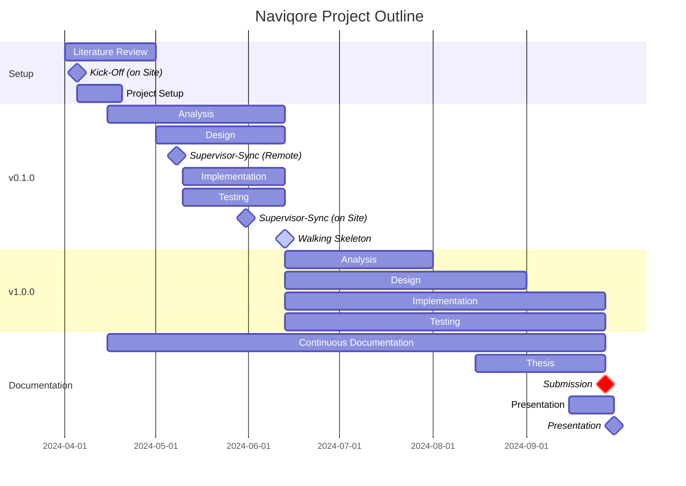

# Naviqore Project Documentation

Documentation of the Naviqore transit routing project.

- Analysis
    - [Requirements](analysis/requirements.md)
    - [Domain Model](analysis/domain-model.md)
    - [Use Case](analysis/use-case.md)
    - [Glossary](analysis/glossary.md)
- Design
    - [System Context](analysis/use-case.md)

## Outline

## Semantic Versioning

## Commit Messages

