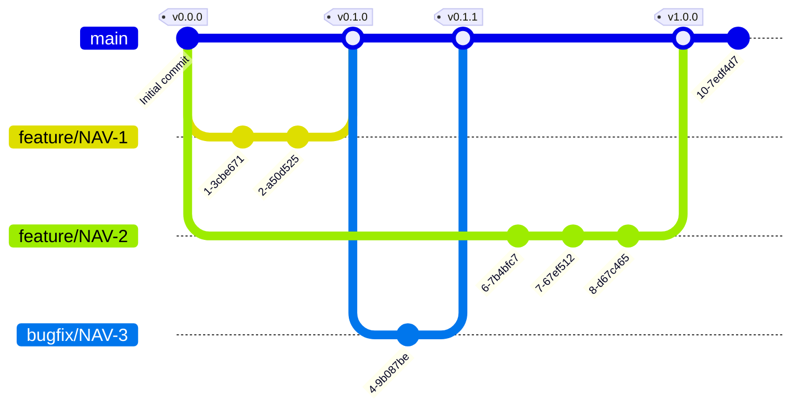

# Git Strategy

We are using [trunc-based development](https://trunkbaseddevelopment.com/).

### Key Principles of Trunk-Based Development:

1. **Single Source of Truth**: Developers commit directly to the trunk/main branch.
2. **Frequent Commits**: Changes are integrated multiple times a day.
3. **Short-Lived Branches**: Feature branches, if used, are short-lived (a few hours to a couple of days).
4. **Automated Testing**: Continuous integration systems run tests on every commit to catch issues early.
5. **Feature Flags**: Incomplete features are integrated into the trunk but are hidden behind feature flags.

### Benefits:

- Faster feedback and resolution of integration issues.
- Simplified codebase management.
- Easier to maintain a releasable state.
- Encourages collaborative development and collective code ownership.

### Trunk-Based Development Flow

