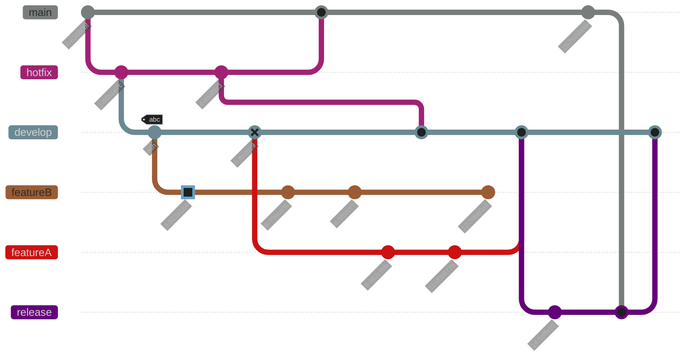

# Git Strategy

GitFlow is a workflow that defines a strict branching model designed around the project release. It assigns very
specific roles to different branches and defines how and when they should interact. This workflow is great for larger
projects with several developers and release cycles.

In GitFlow, there are two main branches: the `master` branch and the `develop` branch. The `master` branch stores the
official release history, and the `develop` branch serves as an integration branch for features.

New features are developed on `feature` branches that branch off from `develop` and must merge back into `develop`. When
the team is ready to release a new version, a `release` branch is created off `develop`. This branch is used for testing
and bug fixing for the release. Once the release is ready to go live, it is merged into `master` and `develop`.

If a critical bug is found in the production version, a `hotfix` branch is created off `master`. Once the bug is fixed,
the `hotfix` branch is merged back into both `master` and `develop`.

This workflow ensures a clean project history and helps manage complex projects by separating different types of work
into different branches.

1. **Start**: The workflow begins with the develop branch, which is the main branch where the development takes place.

2. **New Feature**: If there's a new feature to be added, a new feature branch is created from the develop branch. The
   feature is developed in this branch.

3. **Merge Feature**: Once the feature is complete, the feature branch is merged back into the develop branch. The
   process then loops back to check if there are more features to add.

4. R**elease Time**: If there are no more features to add and it's time for a release, a release branch is created from
   the develop branch. The release is prepared in this branch (like bumping the version number, final testing, etc.).

5. **Merge Release**: Once the release is ready, the release branch is merged into both the master and develop branches.
   The release is then tagged in the master branch, and the release branch is deleted.

6. **Bug Fix**: If there's a bug to fix in the develop branch, a bugfix branch is created. The bug is fixed in this
   branch, and then the bugfix branch is merged back into the develop branch. The process then loops back to check if
   there are more bugs to fix.

7. **Hotfix**: If there's a critical bug in production, a hotfix branch is created directly from the master branch. The
   bug is fixed in this branch, and then the hotfix branch is merged into both the master and develop branches. The
   hotfix is then tagged in the master branch, and the hotfix branch is deleted.

8. **End**: If there are no more features to add, no more releases to prepare, no more bugs to fix, and no more hotfixes
   to apply, the process ends until there's a new feature, release, bug, or hotfix.

