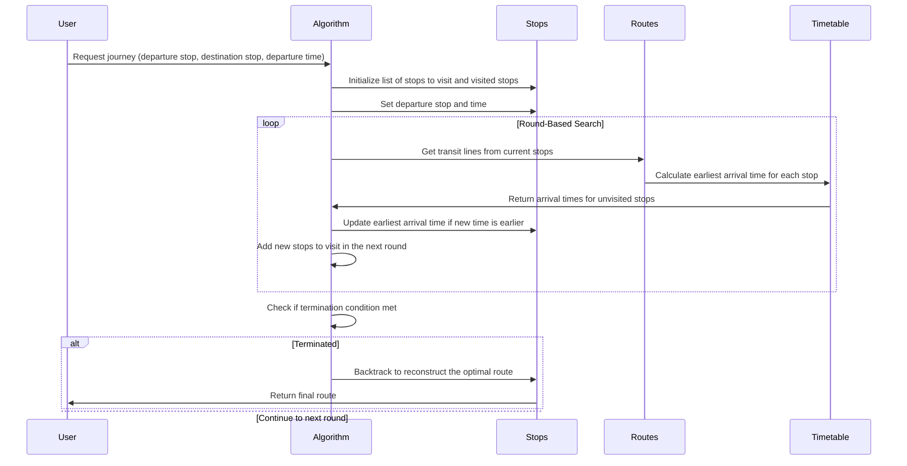

# RAPTOR

The **RAPTOR** (Round-based Public Transit Routing) algorithm is a powerful algorithm to compute optimal routes in
public transportation systems, especially for large and complex networks. Its primary objective is to efficiently
determine the best route options based on factors like arrival time and number of transfers. RAPTOR is particularly
useful for real-time journey planning due to its speed and adaptability.

### Key Concepts of RAPTOR:

- **Initialization**: The algorithm starts at the origin station and time specified by the user. Initially, it only
  considers the starting station, marking it for the first round of exploration.

- **Round-based Search**: The search process is broken into several rounds. In each round, the algorithm evaluates all
  transport lines connected to the current list of stations. It computes the earliest possible arrival times at the
  stations along each line and adds them to the list of stations for the next round.

- **Updating Arrival Times**: As the algorithm processes new stations, it updates their earliest arrival times. If it
  finds a route to a station that is faster than the previously known route, the arrival time and corresponding route
  are updated.

- **Termination Condition**: The algorithm stops when it reaches the destination station with the optimal arrival time
  or when no further improvements can be made after a set number of rounds.

- **Tracing the Optimal Route**: Once the algorithm concludes, the optimal route is reconstructed by tracing the updated
  arrival times back from the destination to the start station.

RAPTOR is highly efficient because it leverages the structure of public transit systems, where it is often faster to
remain on the same line rather than switching between multiple lines. This characteristic makes RAPTOR particularly
suitable for large-scale transportation networks where real-time routing is essential.

## Sequence Diagram RAPTOR



- The algorithm starts at the departure stop at the given departure time. It initializes a list of stops to visit in
  this round (initially just the departure stop), and a list of already visited stops.
- The algorithm performs several "rounds" of search. In each round, it considers all transit lines that stop at the
  stops in the current round. For each line, it calculates the earliest arrival time at each stop along the line that
  hasn't been visited yet, and adds these stops to the list for the next round.
- When the algorithm finds a new stop, it updates the earliest arrival time at this stop. If the new arrival time is
  earlier than the previous one, it updates the route.
- After the algorithm has terminated, the optimal route can be found by backtracking the updated arrival times from the
  destination stop to the departure stop.

## Elements of the Raptor algorithm

### In the context of public transit systems, the following terms are essential:

#### Timetable

- Set S: This is the **collection of stops**, which includes all train stations, platforms, bus stops, and similar
  locations
  where passengers can board or disembark from transit vehicles.
- Set C: This represents the **elementary connections** within the transit network, linking the stops in Set S and
  defining
  the possible routes for trips.
- Set T: This **comprises all trips** made by transit vehicles such as trains, buses, and trams. Each trip follows a
  specific sequence of stops from Set S, connected through the elementary connections in Set C.

##### Network

{width="650"}

##### Stops

{width="650"}

##### Connection

A connection is represented as a 5-tuple:

```tex
c = (v_{dep}(c), v_{arr}(c), \tau_{dep}(c), \tau_{arr}(c), trip(c))
```

V = Vertex (represents a stop from the set S)

- **Departure stop**:

```tex 
- v_{dep}(c) \in S
```

departure stop of the connection c is an element of the set S of stops

- **Arrival stop**:

```tex
v_{arr}(c) \in S
```

- **Trip**:

```tex
trip(c) \in T
```

Example connection times:

- **Departure time**:

```tex
\tau_{dep}(c): 8:00
```

- **Arrival time**:

```tex
\tau_{arr}(c): 8:30
```

{width="650"}

#### Trip

- Sequence of connections

```tex
T = (c_{1} , . . . , c_{k} )
```

- Represents a single vehicle
- driving from first to last stop
- at specific times

{width="650"}

{width="650"}

#### Route

In the context of the RAPTOR algorithm, a **Route** refers to:

- **Definition**: A sequence of trips that share the same sequence of stops.
- **Function**: Vehicles like buses or trains follow these predefined lines to pick up and drop off passengers at each
  stop.
- **Usage**: The RAPTOR algorithm processes each route to compute arrival times and determine the fastest journey with a
  limited number of transfers.
- **Optimization**: Routes are scanned efficiently, with the algorithm looking at each route at most once per round,
  contributing to RAPTOR's speed and dynamic capabilities.

{width="650"}

## The RAPTOR Algorithm Explained in Detail

### Key Features of RAPTOR

**Pareto-Optimality:** RAPTOR computes Pareto-optimal journeys, meaning it considers multiple criteria, such as earliest
arrival time and the fewest transfers. A journey is Pareto-optimal if no other journey is better in both criteria.

**Round-based Processing:** The algorithm processes journeys in rounds, where each round computes the arrival times for
journeys that use a specific number of transfers.

**Efficient Route Scanning:** RAPTOR explicitly uses the structure of public transit timetables, scanning each transit
route
at most once per round. This ensures that the algorithm is fast and scalable, even for large transit networks.

### How RAPTOR Works

**Initialization:**
Given a source stop s, a target stop t, and a departure time τ_dep, the algorithm initializes the journey from s.

**Rounds:**
Each round k computes all journeys with exactly k trips. In the first round, RAPTOR computes journeys with no transfers,
i.e., direct trips. In subsequent rounds, it computes journeys with one transfer, two transfers, and so on.

{width="650"}

**Route Scanning:**
For each round, the algorithm iterates over every stop on a route and checks whether the current trip improves the
arrival time at the next stop. This ensures that RAPTOR efficiently computes the earliest arrival time for each stop in
a transit network.
Each stop maintains a label indicating its earliest arrival time for the current round. RAPTOR compares these labels and
updates them if a faster journey is found.

{width="650"}

{width="650"}

**Stopping Condition:**
The algorithm terminates when no further improvements in arrival times are possible, ensuring it only performs the
necessary number of rounds.

### Key Observations

**Transfer Handling:**
The need for transfers between trips is handled by incrementing rounds. Each round computes the
earliest arrival times for journeys with exactly k transfers.

**Efficiency:**
RAPTOR is designed to scan each route only once per round, which significantly improves its computational
efficiency. Routes that do not provide any useful connections are skipped in later rounds.

**Marking and Pruning:**
After each round, RAPTOR marks stops where arrival times were improved. In the next round, only
routes passing through marked stops are scanned, further optimizing performance.

### Practical Use

RAPTOR's design makes it suitable for real-time, interactive journey planning, where users may need fast responses to
queries about optimal public transit routes. The algorithm can also be extended to handle additional criteria like fare
zones or transfer reliability, making it highly adaptable to different transit systems.