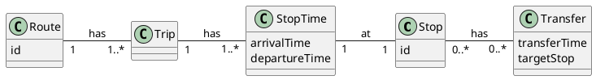

# RAPTOR

The RAPTOR (**R**ound-b**A**sed **P**ublic **T**ransit **O**ptimized **R**outer) algorithm is a powerful tool for
computing optimal routes in public transportation systems, particularly for large and complex networks. Its primary goal
is to efficiently determine the best route options based on factors like arrival time and the number of transfers.
RAPTOR is especially effective for real-time journey planning due to its speed and adaptability.

The data used by the RAPTOR algorithm is significantly simplified compared to the full GTFS schedule. The algorithm
focuses on just five key components. As illustrated in Figure 1, a public transit network consists of a set of routes
and stops. Each route is made up of trips, all of which follow the same sequence of stops. A trip is essentially a
container that includes a set of stop times, which provide the arrival and departure times for each stop along the trip.
Additionally, stops contain information about potential transfers to other stops, facilitating passenger connections
within the network.

## How RAPTOR works

- **Initialization**: The algorithm starts at the origin station and time specified by the user. Initially, it only
  considers the starting station, marking it for the first round of exploration.

- **Initial Footpath Relaxation**: Before starting the main loop, the algorithm relaxes footpaths from the starting
  station to other nearby stations. This step allows the algorithm to consider other stations that are within walking
  distance of the starting station.

- **Round-based Search**: The search process is broken into several rounds. In each round, the algorithm evaluates all
  transport lines connected to the current list of stations. It computes the earliest possible arrival times at the
  stations along each line and marks stops for the next round if an improvement is found.

- **Footpath Relaxation**: After each round, the algorithm relaxes footpaths from the newly marked stops to other nearby
  stations. This allows adding further stations to the list of stops to be considered in the next round.

- **Termination Condition**: The algorithm stops when it reaches the destination station and none of the marked stops
  have the ability to improve the arrival time of the destination station (all possible routes have been explored).

- **Tracing the Optimal Route**: Once the algorithm concludes, the optimal route is reconstructed by tracing the updated
  arrival times back from the destination to the start station.

RAPTOR is highly efficient because it operates directly on schedule information without the need to build extensive
graphs that incorporate the complexity of transfers. This characteristic makes RAPTOR particularly suitable for networks
of any size, as it avoids the need for time-consuming preprocessing. This efficiency allows us to enable features like
accessibility and bike information on our routes.

## Pareto-Optimal Connections in RAPTOR

One of the core features of the native RAPTOR algorithm is its ability to compute **Pareto-optimal connections**. A
connection is Pareto-optimal if no objective (e.g., arrival time or the number of transfers) can be improved without
worsening the other. RAPTOR achieves this by minimizing the earliest arrival time while also considering the number of
transfers. It processes the network in rounds, ensuring that it returns the fastest routes with the fewest transfers. As
a result, RAPTOR guarantees that no further improvement can be made on any route without negatively impacting another
factor, such as increasing transfers or delaying arrival time.

## RAPTOR Extensions

**Range RAPTOR** is an extension of the classic RAPTOR algorithm, specifically designed to handle multiple departure
times efficiently. Instead of calculating the optimal route for just a single departure time, it determines the best
route over a range of potential departure times. This makes it particularly useful for trip planning within a time
window, where the goal is to find the earliest possible arrival time given any departure between specified hours (
e.g., "find the earliest arrival if I leave anytime between 8:00 and 10:00 AM"), ultimately reducing travel time. The
algorithm efficiently handles these multiple scenarios by leveraging the underlying RAPTOR structure, applying it over
the entire range while ensuring that the returned connections are still Pareto-optimal.

**Multi-Criteria RAPTOR (mcRAPTOR)** extends the original RAPTOR algorithm by considering additional optimization
criteria, such as fare, comfort, or walking distance, alongside the traditional criteria of arrival time and number of
transfers. This multi-criteria extension computes Pareto-optimal solutions that account for these extra dimensions. The
challenge with mcRAPTOR lies in balancing these additional criteria without sacrificing computational efficiency.
However, it still adheres to RAPTOR's core principle of fast, round-based processing, providing more tailored route
suggestions based on multiple user preferences.
