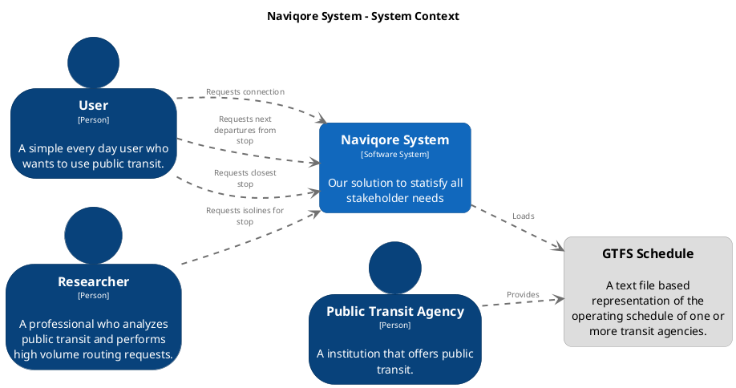
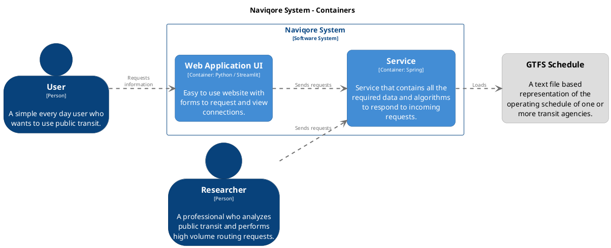
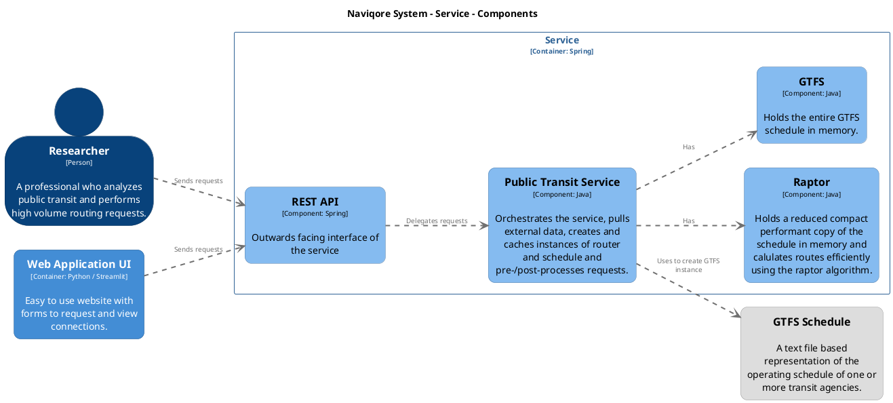

# C4 Model

The C4 model is a simple, hierarchical way of visualizing software architecture. It consists of four layers:

- **System Context**: Shows how the system interacts with its environment.
- **Containers**: Defines high-level containers (applications, services, databases) that make up the system.
- **Components**: Focuses on the internal structure of each container, showing the components and how they communicate.
- **Code**: Zooms in on the details of individual components (often omitted in higher-level diagrams). In general, it is
  not recommended to create this layer, since it can be generated in modern IDEs.

## System Context

This diagram visualizes the Naviqore system and its main actors. These actors include the *User*, *Researcher*, and
*Public Transit Agency*, which interact with the system, and the GTFS schedule which is provided by the agency.

<!--

-->

## Container

This diagram breaks down the Naviqore system into its primary containers. These include the *Web Application UI* and the
*Service*, which depend on the GTFS schedule to fulfill requests.

<!--

-->

## Component

This diagram drills into the Service container, showing its key internal components such as the *Raptor*, *GTFS*, *REST
API*, and *Public Transit Service*.

<!--

--> 

<!--
// https://structurizr.com/dsl

workspace {

    model {
        user = person "User" {
            description "A simple every day user who wants to use public transit."
        }
        researcher = person "Researcher" {
            description "A professional who analyzes public transit and performs high volume routing requests."
        }
        agency = person "Public Transit Agency" {
            description "A institution that offers public transit."
        }
        gtfsSchedule = element "GTFS Schedule" {
            description "A text file based representation of the operating schedule of one or more transit agencies."
        }
        
        
        softwareSystem = softwareSystem "Naviqore System" {
            description "Our solution to statisfy all stakeholder needs"
            wa = container "Web Application UI" "Streamlit User Interface" {
                technology "Python / Streamlit"
                description "Easy to use website with forms to request and view connections."
            }
            service = container "Service" "Spring Service with REST API Endpoints" {
                technology "Spring"
                description "Service that contains all the required data and algorithms to respond to incoming requests."
                springApp = component "REST API" {
                    technology "Spring"
                    description "Outwards facing interface of the service"
                }
                publicTransitService = component "Public Transit Service" {
                    technology "Java"
                    description "Orchestrates the service, pulls external data, creates and caches instances of router and schedule and pre-/post-processes requests."
                }
                raptor = component "Raptor" {
                    technology "Java"
                    description "Holds a reduced compact performant copy of the schedule in memory and calulates routes efficiently using the raptor algorithm."
                }
                gtfs = component "GTFS" {
                    technology "Java"
                    description "Holds the entire GTFS schedule in memory."
                }
            }
        }
        

        // context diagram
        user -> softwareSystem "Requests connection"
        user -> softwareSystem "Requests next departures from stop"
        user -> softwareSystem "Requests closest stop"
        researcher -> softwareSystem "Requests isolines for stop"
        softwareSystem -> gtfsSchedule "Loads"
        agency -> gtfsSchedule "Provides"
        
        // container diagramm
        user -> wa "Requests information"
        researcher -> service "Sends requests"
        wa -> service "Sends requests"
        service -> gtfsSchedule "Loads"
        
        // service components diagramm
        wa -> springApp "Sends requests"
        researcher -> springApp "Sends requests"
        springApp -> publicTransitService "Delegates requests"
        publicTransitService -> raptor "Has"
        publicTransitService -> gtfs "Has"
        publicTransitService -> gtfsSchedule "Uses to create GTFS instance"
    }

    views {
        systemContext softwareSystem "Context_Diagramm" {
            include * agency
            autolayout lr
        }

        container softwareSystem "Diagram2" {
            include *
            autolayout lr
        }
        
        component service "Service_Components" {
            include *
            autolayout lr
        }
        
        theme default
    }

}
-->