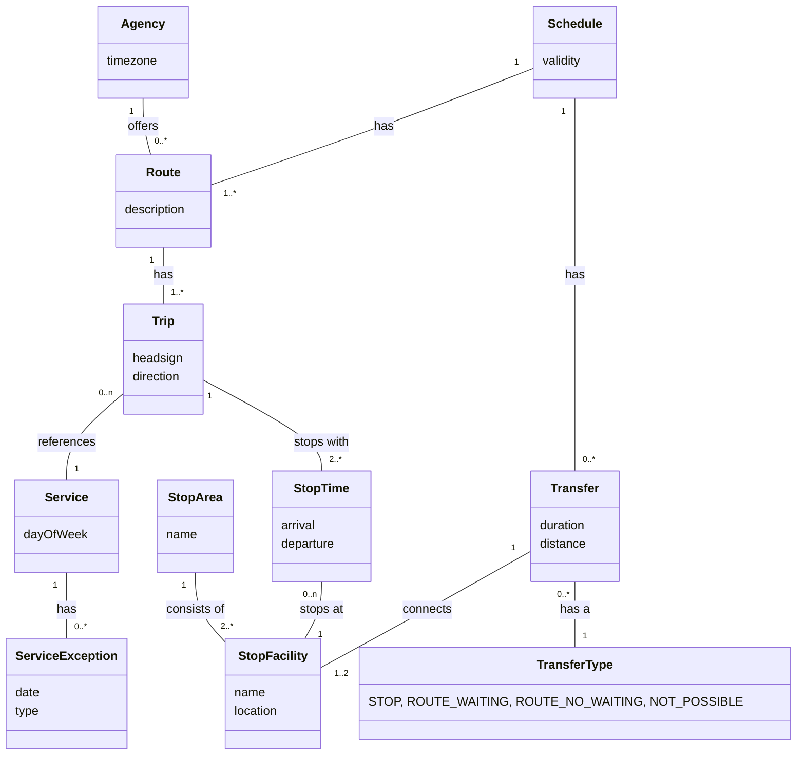
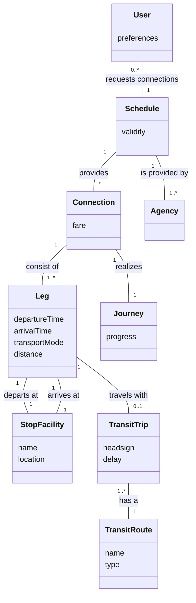

# Domain Model

## Agency Perspective

```mermaid
classDiagram
    class Agency {
        timezone
    }
    class Schedule {
        validity
    }
    class Service {
        dayOfWeek
    }
    class ServiceException {
        date
        type
    }
    class StopArea {
        name
    }
    class StopFacility {
        name
        location
    }
    class Route {
        description
    }
    class Trip {
        headsign
        direction
    }
    class StopTime {
        arrival
        departure
    }
    class Transfer {
        duration
        distance
    }
    class TransferType {
        STOP, ROUTE_WAITING, ROUTE_NO_WAITING, NOT_POSSIBLE
    }

    StopArea "1" -- "2..*" StopFacility: consists of
    Schedule "1" -- "1..*" Route: has
    Schedule "1" -- "0..*" Transfer: has
    Service "1" -- "0..*" ServiceException: has
    Agency "1" -- "0..*" Route: offers
    Route "1" -- "1..*" Trip: has
    Trip "0..n" -- "1" Service: references
    Trip "1" -- "2..*" StopTime: stops with
    StopTime "0..n" -- "1" StopFacility: stops at
    Transfer "1" -- "1..2" StopFacility: connects
    Transfer "0..*" -- "1" TransferType: has a

```

## User Perspective

```mermaid
classDiagram
    class Schedule {
        validity
    }
    class User {
        preferences
    }
    class Connection {
        fare
    }
    class StopFacility {
        name
        location
    }
    class Leg {
        departureTime
        arrivalTime
        transportMode
        distance
    }
    class Journey {
        progress
    }
    class TransitRoute {
        name
        type
    }
    class TransitTrip {
        headsign
        delay
    }

    Schedule "1" -- "1..*" Agency: is provided by
    User "0..*" -- "1" Schedule: requests connections
    Schedule "1" -- "*" Connection: provides
    Connection "1" -- "1" Journey: realizes
    Connection "1" -- "1..*" Leg: consist of
    Leg "1" -- "1" StopFacility: departs at
    Leg "1" -- "1" StopFacility: arrives at
    Leg "1" -- "0..1" TransitTrip: travels with
    TransitTrip "1..*" -- "1" TransitRoute: has a


```