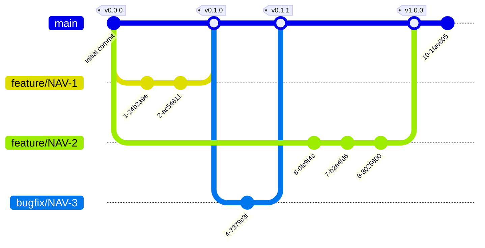

# Git Best Practices

## Guideline for Commit Messages

Commit message format explained by a sample commit message:

    Capitalized, short (50 chars or less) summary

    More detailed explanatory text, if necessary.  Wrap it to about 72 characters or so.  In some contexts, the first line is treated as the subject of an email and the rest of the text as the body.  The blank line separating the summary from the body is critical (unless you omit the body entirely); tools like rebase can get confused if you run the
    two together.

    Write your commit message in the imperative: "Fix bug" and not "Fixed bug" or "Fixes bug."  This convention matches up with commit messages generated by commands like git merge and git revert.

    Further paragraphs come after blank lines.
    - Bullet points are okay, too
    - Typically a hyphen or asterisk is used for the bullet followed by a single space, with blank lines in between, but conventions vary here
    - Use a hanging indent

Source:<https://tbaggery.com/2008/04/19/a-note-about-git-commit-messages.html>

The summary line must be formatted as follows:

    {TYPE}: {ISSUE} - {SUMMARY}.

    {ISSUE}: Id of related Jira Issue. Example: NAV-2.

    {SUMMARY}: See previous section

    {TYPE}: Commit type, must be any of the following:

* ENH: New functionality / Feature Implementation
  (add, improve, or remove functionality; changes application behavior)
* FIX: fixing something that does not work correctly
* STYLE: Minor cosmetic changes to code (ie rename variables for clarity)
  which do not change the behavior of the code
* REFACTOR: improve code organization or implementation
  for maintainability purposes
* DOC: documentation only change (source code or user documentation)
* ORG: organizational changes, e.g. adding .gitignore file or .vscode/settings.json
* TEST: adding or changing a test; does not affect application behavior

Example:

    ENH: NAV-2 - Implement sorting by date to tasklist

## Guideline for Reviewers

Reviewing happens typically in two stages, during pull requests and when
signing off the Jira issue.

Review & approval order

* Developer creates a Pull Request (PR)
* Reviewer reviews PR, performs testing, proposes changes etc.
* Once good, reviewer approves the PR
* Reviewer closes the Jira issue
* Reviewer merges the PR

## Git Strategy

We are using [trunc-based development](https://trunkbaseddevelopment.com/).

### Key Principles of Trunk-Based Development:

1. **Single Source of Truth**: Developers commit directly to the trunk/main branch.
2. **Frequent Commits**: Changes are integrated multiple times a day.
3. **Short-Lived Branches**: Feature branches, if used, are short-lived (a few hours to a couple of days).
4. **Automated Testing**: Continuous integration systems run tests on every commit to catch issues early.
5. **Feature Flags**: Incomplete features are integrated into the trunk but are hidden behind feature flags.

### Benefits:

- Faster feedback and resolution of integration issues.
- Simplified codebase management.
- Easier to maintain a releasable state.
- Encourages collaborative development and collective code ownership.

### Trunk-Based Development Flow

