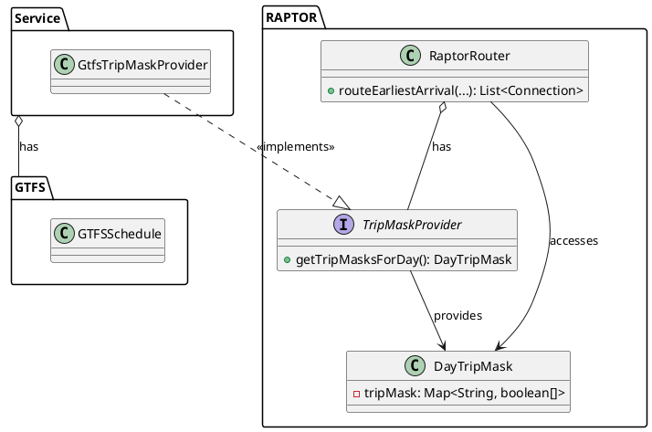

# Extended RAPTOR

The theoretical RAPTOR algorithm proposed by Delling et al. [4], while innovative, lacks several practical features
necessary for real-world applications. These missing elements include reverse time routing (i.e., routing backwards from
the arrival time and stop), key query configurations like setting a maximum walking distance between stops, defining
minimum transfer times, and limiting the number of allowable transfers. Additionally, the original implementation does
not account for diverse travel modes (e.g., tram, bus, rail), accessibility options for wheelchairs and bicycles, or the
ability to route across multiple schedules spanning different service days.

In our extended RAPTOR implementation, we have addressed all of these gaps by incorporating these critical features,
enhancing the algorithm’s usability for real-world transit planning.

## Latest Departure

Implementing latest departure routing, which calculates the latest possible departure from a departure stop given a
specified latest arrival time, did not introduce any new algorithmic concepts. However, achieving this in a way that
minimizes code duplication while maintaining readability presented significant challenges. The primary difficulty lay in
adapting the logic for reverse-time routing. In contrast to the earliest arrival routing, where the source stop is
always the departure stop and the target stop is the arrival stop, these roles are reversed in latest departure routing.
The source stop becomes the arrival stop, and the target stop is now the departure stop, as routing progresses backward
in time.

This shift required changes to the variable naming conventions in the code. To avoid confusion, we adopted a generalized
terminology where the "source stop" refers to the stop from which the scanning process begins (regardless of the
direction), and the "target stop" refers to the destination of the scan. Additionally, loops that previously scanned for
the earliest possible departure now had to scan for the latest possible arrival, requiring trips to be processed in
reverse—starting from the latest possible trip rather than the earliest.

One of the biggest challenges was handling the conditional logic, which differs between earliest arrival and latest
departure objectives. For earliest arrival, the algorithm marks the earliest arrival at each stop for further scanning,
while for latest departure, the latest departure is marked. Implementing this distinction without duplicating large
portions of code was nontrivial.

To strike a balance between maintainability and readability, we opted for an approach that introduces checks based on
the current routing direction (i.e., earliest arrival vs. latest departure) within the same codebase, despite the added
complexity. This approach was chosen over duplicating the entire algorithm with minor changes for each routing type, as
the latter would have made long-term maintenance significantly more difficult.

## Multi-day

The standard RAPTOR algorithm does not account for service days in a schedule, as it is primarily designed to scan
routes based solely on departure times in ascending order. Given that GTFS schedules typically span a full year,
directly chaining all departures in the stop times array would have resulted in an excessively large array, severely
impacting performance.

In the early iterations of our RAPTOR implementation, we opted to build RAPTOR data structures for a single service day
to address this issue. However, this approach introduced several limitations. For instance, a typical service day begins
at 5 AM and extends into the early hours of the next calendar day (around 1 AM or 5 AM, depending on the availability of
night services). As a result, routing requests for a local trip with a departure time at 12:00 AM might ideally be
served by trips from the previous service day, but the algorithm would only display departures starting from 5 AM
onward. Similarly, long-distance trips departing later in the afternoon would not be fully accommodated within the same
service day, requiring the journey to extend into the next service day. This setup created gaps in service availability
for both late-night and long-distance trips, necessitating further refinement of the algorithm.

An additional constraint for the RAPTOR implementation was that it should remain agnostic of the underlying GTFS
schedule. This separation needed to be preserved in our design. To achieve this, we introduced a TripMaskProvider
interface that could be injected into the RAPTOR implementation via dependency injection. This allowed the RAPTOR
algorithm to process schedule data without directly interacting with the GTFS implementation.

### Trip Mask Provider

In our solution, the RAPTOR algorithm queries the `TripMaskProvider` for trip masks corresponding to different service
days when handling a routing request. Typically, the algorithm requests trip masks for three days: the previous day, the
current day, and the next day. Once the trip masks are retrieved, the routing process can begin, ensuring RAPTOR
operates independently of how the schedule data is provided.

Here's the simplified UML diagram for this design:

The `DayTripMask`s provided by the `TripMaskProvider` consisted of a map, where the keys represented route IDs, and the
values were boolean arrays that acted as masks. These arrays indicated which trips on a route were active on a given
day. During route scanning, the process would typically begin by scanning the day trip mask for the previous day, then
move to the current day's mask, and, if necessary, to the following day's mask if no suitable departure was found
earlier. In the route scanner code, an additional check was implemented to ensure that the trip at the specified offset
was active by verifying it against the day trip mask.

However, these modifications had a notable impact on performance. Routing requests, which previously met the target, now
took around 250 milliseconds, falling short of the requirement for a response time of under 200 milliseconds. This
highlighted the need for further optimizations to meet performance expectations.

### New Stop Times Array Layout and Stop Times Provider

To address the performance issues, several improvements were identified and implemented. These included optimizing how
departure times were accessed and restructuring the internal data to improve memory usage and scanning efficiency.

* **Easy Lookup Variables:** To reduce the number of stop time lookups, new variables were added to quickly determine if
  a route had any departures after the first available departure time.
* **Memory Optimization:** The stop times array was changed from an array of `StopTime[]` objects to an array of `int[]`
  to take advantage of cache locality. Since both arrival and departure times were integer values, this conversion
  allowed for more efficient memory access.
* **Pre-building Stop Times Array:** The stop times array is now pre-built before routing began, using
  the `DayTripMask` to mask invalid stop times by setting them to `Integer.MIN_VALUE`. This eliminated the need for
  multiple lookups during route scanning.

To implement these changes, an additional class called `StopTimeProvider` was introduced. It takes
the `TripMaskProvider` as an injected dependency and is responsible for creating `int[]` stop time arrays for a given
service day. These arrays contain all trips for each route, sorted by departure time, with additional improvements:

* **Service Day-level Information:** At indices 0 and 1 of the stop times array, data is included about the earliest
  departure and latest arrival for the entire service day. This allows the algorithm to skip scanning the previous day
  if, for instance, the routing request is for 8 AM and the previous day’s service ends at 5 AM.
* **Route-level Information:** Each route's partition in the array includes two additional values at the start,
  indicating the earliest departure and latest arrival for that route. This further optimizes the process by allowing
  the algorithm to avoid scanning trips on a route if it is inactive at the requested time.
* **Simplified Stop Times:** Each stop time now consists of two integer values (arrival and departure times), replacing
  the previous `StopTime` object, leading to faster data access.

This new structure enabled the stop times array to serve multiple purposes while significantly improving routing
performance, from 250 ms down to approximately 90 ms. However, accessing the correct information in the array became
more complex, as shown in the figure below.

{ width="750" }

## Accessibility and Bike Information

After implementing the multi-day logic for routing and adding functionality to the RAPTOR module to allow external
masking of trips using schedule information, it became straightforward to extend the `QueryConfig` values to accommodate
additional routing request parameters. These new parameters include options such as preferred travel modes (e.g., bus,
train, ship) and specific requirements like ensuring that all trips are wheelchair accessible or allow bikes.

Technically, nothing significant changed in the core logic of the RAPTOR algorithm. However, the stop time arrays now
became specific not only to the service day but also to the query configuration, meaning each set of preferences (e.g.,
travel mode, accessibility) would result in a unique stop time array. This led to an increase in the number of potential
stop time arrays that needed to be cached, but it allowed for greater flexibility in handling diverse routing requests.

## Caching

As expected, computing stop time arrays from schedule information using the `StopTimeProvider` and `TripMaskProvider`
introduces significant overhead. Typically, this computation takes around 400–500 milliseconds per service day and
query configuration, resulting in approximately 1200-1500 milliseconds for a multi-day routing request. To avoid
recalculating these arrays for each new request, caching was identified as an effective solution.

To address this, a Least Recently Used (LRU) eviction cache was implemented to store the computed stop time arrays.
This allows frequently accessed stop time arrays to remain in memory, while less-used ones are evicted to free up space.

However, it's important to note that for the Swiss GTFS schedule, the stop time arrays can be quite large—around 16
million integer values, corresponding to a memory footprint of 64 MB per service day and query configuration
combination. This substantial memory requirement means that the application needs to run on machines with
significant memory resources or, ideally, in a distributed system for production. In such a system, a load balancer
would distribute routing requests from the front-end layer across replicas of the router based on the available cached
stop time arrays, ensuring that the application can run efficiently without excessive recalculations or memory strain.
Unfortunately, a setup like this sacrifices the stateless nature of the application. To account for this, the stop time
arrays and the GTFS schedule could be stored in a database, encapsulating the state within the database rather than the
application, allowing for stateless load balancing.

TODO: Maybe move to results and discussion?
