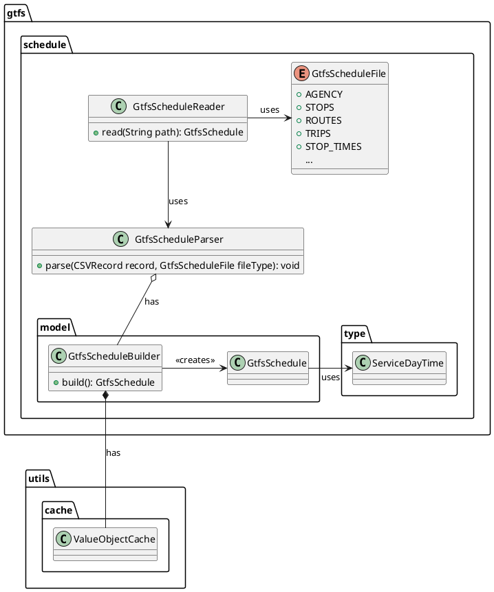

# GTFS Schedule

In the public transit service, only GTFS schedule data is utilized, which provides static transit service information
for a specified validity period, without incorporating GTFS realtime data. The GTFS reader class processes all required
files and fields, as well as some optional fields (accessibility) and optional files (transfers). The reader scans the
corresponding CSV files and, in order to minimize memory usage, calls the `GtfsScheduleParser` to parse each record on
the fly. The parser converts the string values from the CSV file into the appropriate data types and passes them to
the `GtfsScheduleBuilder`, which constructs a valid `GtfsSchedule`.

The `GtfsScheduleBuilder` applies the **fail-fast principle**, ensuring that it only accepts valid inputs, and will fail
immediately if any invalid or missing data is encountered. Error handling is delegated to the `GtfsScheduleParser`,
which catches and logs any errors, such as malformed data, during the parsing process. This guarantees that the builder
only receives valid data. As a result, by the time the GTFS data is fully processed, the system can confidently expect a
valid GTFS schedule to be stored in memory.

Since no changes are expected after reading the GTFS schedule data, the data is sorted and transformed into immutable
data structures. This means that the various collections in the `GtfsSchedule` class, such as `ArrayLists`, are trimmed
to the size of their contained objects. Similarly, the hash functions and load factors of the `HashMaps` are optimized
based on their final size. To further reduce the memory footprint, frequently occurring value objects, such as service
day times in stop times, local dates in calendar dates or calendar date exceptions, and string values (e.g., trip head
signs), are cached using a value object cache. This caching mechanism ensures that repeated values are stored
efficiently.

The effect of converting these collections into read-only data structures can be observed in the profiled memory usage
during the reading of the GTFS for Switzerland, with a noticeable drop in memory consumption at the end of the process:

{ width="450" }

By employing these memory-optimized data structures and value object caching, the requirement **NF-SC-M1** is satisfied,
allowing the GTFS static data for Switzerland to be stored in memory with a consumption of under 1.5GB.
