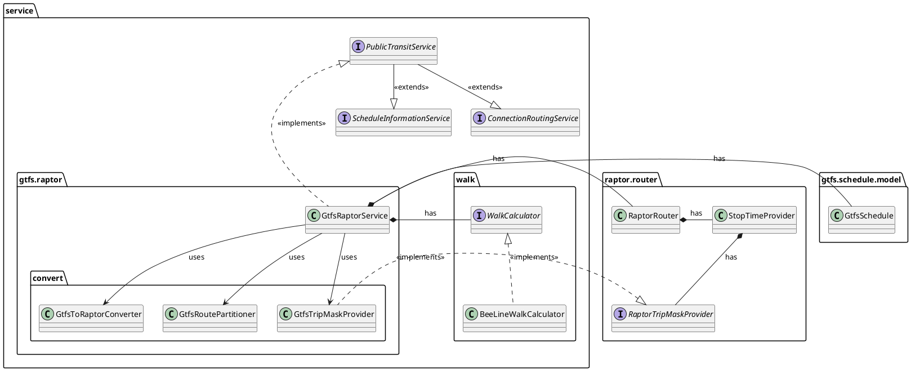

# Public Transit Service

In the service layer of our architecture, use cases intersect with the technical details of transit schedules and
routing. These details are abstracted behind the `PublicTransitService` interface, ensuring that the application only
interacts with well-defined interfaces without needing to know the underlying complexity. This package has two
primary objectives:

1. **Stable Service Interface**: To provide a consistent and abstract interface that remains independent of the
   specific public transit schedule or routing implementation and potentially allows changing the implementation.
2. **Concrete Service Implementation**: To integrate a concrete data source and routing engine, in our case,
   the `GtfsRaptorService`, which implements the `PublicTransitService` interface.

The `PublicTransitService` is divided into two responsibilities covered by the `ScheduleInformationService` and
the `ConnectionRoutingService` interfaces.



## Schedule Information Service

The schedule information service assists users in navigating public transit schedules. Users may need to search for
stops by name or find nearby stops based on their current location. Once a stop is selected, the user can retrieve
information about routes and upcoming departures.

To optimize these operations, the `GtfsRaptorService` employs various indexing structures:

1. **KDTree for Geospatial Queries**: To efficiently answer proximity queries (e.g., *"What are the nearest stops to my
   location?"*), we use a k-dimensional tree (KDTree) that operates on geographic coordinates (latitude and longitude).
   The distances between these coordinates are approximated using the Haversine formula [15], which provides sufficient
   accuracy for most inhabited areas of the Earth (excluding extreme polar regions).

2. **Compressed Trie for String Matching**: For searching stops by name, we implemented a compressed trie data
   structure. This allows for efficient storage and retrieval of stop names based on prefix matching. The trie is filled
   with all the stop names by inserting suffixes of the stop names into the structure [14]. This approach enables fast
   lookups for queries like *"find stops whose names starts with, contains or ends with this substring."* Exmaple of how
   the suffixTrie is filled:

      ```java
      public class SearchIndex<T> {
   
          // ...
   
          public void add(String key, T value) {
   
              for (int i = key.length() - 1; i >= 0; i--) {
                  suffixTrie.insert(key.substring(i), entry);
              }
   
          }
   
      }
      ```

Using these indices, queries for stops are highly efficient. The trade-off, however, is that these data structures
consume more memory.

## Connection Routing Service

The `ConnectionRoutingService` is responsible for finding connections between transit stops. In our `GtfsRaptorService`
implementation, this service interacts with the [extended RAPTOR routing engine](extended-raptor.md), which processes
routing requests based on the GTFS schedule data.

### Route Partitioning

The GTFS model and RAPTOR algorithm have differing perspectives on routes. In GTFS, a "route" refers to a user-friendly
view of trips that may share a common line number or route name, even if the stop sequences differ slightly. For
instance, a regional train might have trips that skip certain stops on later trips while still being part of the same
route from a user's point of view.

However, RAPTOR requires that all trips associated with a route must have the exact same stop sequence. This discrepancy
is resolved by the `GtfsToRaptorConverter` by applying the `GtfsRoutePartitioner`, which splits GTFS routes into "
sub-routes". These sub-routes group trips that share identical stop sequences, ensuring compatibility with RAPTOR’s
routing model. During post-processing, when the routing results are returned to the user, the sub-routes are converted
back into the original GTFS routes to maintain user-friendly responses.

### Transfer Generation

In GTFS, the transfer file is optional, meaning not all transfers between stops may be defined. To handle this, we
introduced an optional transfer generation step in the `GtfsToRaptorConverter`. This step uses
the `WalkTransferGenerator` to generate walking transfers between stops that are within a reasonable walking distance
but are missing from the GTFS transfer data. Even when GTFS transfer data is provided, the generator can add missing,
but viable, transfers and thus improve the connection results.

The walking distances between stops are calculated using a `WalkCalculator`. This implementation uses a **beeline
distance factor**, typically set to 1.3 based on literature [13, p. 43], to account for real-world walking conditions
such as obstacles, detours, or building access routes. The calculator multiplies the straight-line distance by this
factor to approximate a more realistic walking time. The `WalkCalculator` interface allows for easy replacement with
more advanced footpath routing solutions, such as A* or A+ Landmark algorithms, if needed.

### Handling Coordinates

In routing requests, users can specify coordinates (latitude/longitude) or stops as the origin or destination. When
coordinates are provided, the `GtfsRaptorService` first identifies the nearest stops using an existing KDTree that
indexes all the stops. The walking time to these stops is calculated using the `WalkCalculator` instance, and only stops
within a reasonable walking duration, defined in the service configuration at startup, are considered in the routing
request.

Once the RAPTOR routing engine processes the request, it calculates routes between the identified stops and returns the
connection results. The `GtfsRaptorService` then enriches these results with walking segments (first mile and last
mile), which represent the walk from the start coordinate to the selected origin stop and from the destination stop to
the final coordinate.

In summary, the `ConnectionRoutingService` performs pre-processing to identify nearby stops, routes the request using
the RAPTOR engine, and post-processes the results by adding walking segments and re-aggregating sub-routes to provide
user-friendly routing information.

**Note:** Since we also support routing based on the latest departure, which involves routing backwards in time, we use
the terms "source" and "target" stop in the code. However, in this explanation, we use the more common terms "origin"
and "destination" for clarity.
