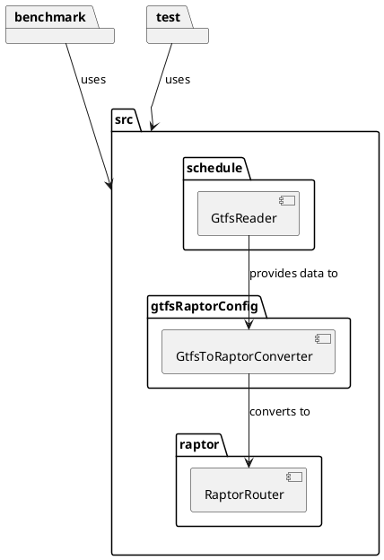
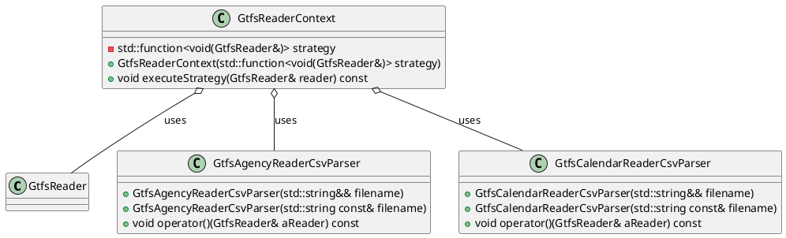
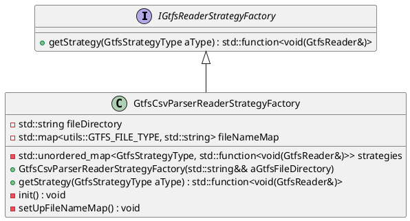

# RAPTOR++

This section discusses the design, implementation, and optimization of a public transport routing system, developed
using modern C++20/C++23 standards. The project incorporates advanced data structures and algorithms to enable
efficient route planning, with an emphasis on cross-platform compatibility and robust build configurations via CMake.

The C++ implementation is heavily inspired by the [Simple RAPTOR](simple-raptor.md) and
utilizes modern C++ features. This section focuses on the C++ implementation, detailing the key components and
challenges encountered during development.

The C++ implementation comprises:

1. A schedule reader.
2. A module for converting GTFS data into the RAPTOR structure.
3. A RAPTOR algorithm module.
4. A Geometry helper module
5. A wrapper of [spdlog](https://github.com/gabime/spdlog) for logging purpose



We aimed to utilize the most modern C++ features possible. Although we initially attempted to implement the project
using the new C++ module system, limited compiler support (primarily from MSVC on Windows) posed challenges.

### Challenges of Implementing in C++

The implementation of RAPTOR in C++ was aimed at leveraging the language's potential for superior performance compared
to Java. However, this endeavor turned out to be more challenging than initially expected, particularly because of
Java's highly optimized Java Virtual Machine (JVM), which often provides excellent performance through Just-In-Time (
JIT) compilation and other built-in optimization strategies. While C++ offers more granular control over system
performance, several complex aspects of development in C++—including cross-platform compatibility, memory management,
and build management—introduced significant hurdles.

#### Cross-Platform Compatibility

One of the primary challenges in implementing RaptorXX in C++ is ensuring cross-platform compatibility. Unlike Java’s "
write once, run anywhere" philosophy, which abstracts away platform differences through the JVM, C++ developers must
account for variations in compilers, libraries, and system calls across operating systems like Windows, Linux, and
macOS. This requires conditional compilation and platform-specific code to handle these differences, adding complexity
to the project.

Additionally, the C++ Standard Library (STL), while powerful, does not offer built-in support for many common tasks,
such as logging or CSV parsing. In contrast, Java's comprehensive standard library offers out-of-the-box solutions. In
C++, developers often need to rely on third-party libraries like`spdlog` for logging or `csv-parser` for file handling,
further complicating development. Furthermore, C++ compilers do not universally support all C++20 features, requiring
careful attention to compatibility issues for seamless cross-platform development.

(compiler_support.png){width="600"}

#### Memory Management

Memory management is another area where C++ introduces complexity compared to Java. Java automatically handles memory
management via garbage collection, allowing developers to focus on high-level design without worrying about manual
resource allocation. In contrast, C++ requires developers to manually manage memory, which introduces risks such as
memory leaks, buffer overflows, and dangling pointers.

Though modern C++ provides tools like smart pointers (`std::unique_ptr`, `std::shared_ptr`) to alleviate some of these
concerns, their correct use requires meticulous planning. The burden of manual memory management in C++ contrasts
sharply with the ease of Java's automated garbage collection, where such issues are mostly abstracted away.

#### Error Handling

While both C++ and Java use exceptions for error handling, C++ introduces additional complexity in ensuring exception
safety and resource cleanup. In Java, the combination of try-catch blocks and automatic memory management simplifies
this process. However, in C++, developers must carefully design their code to release resources manually, especially in
the presence of exceptions. Although C++ has best practices like RAII (Resource Acquisition Is Initialization) to manage
resources efficiently, implementing them correctly requires more effort than in Java.

#### Dependency and Build Management

Another significant challenge with C++ development lies in managing dependencies and the build process. Java's mature
ecosystem, featuring tools like Maven and Gradle, simplifies dependency management and build configuration, providing
tight integration with development environments. In contrast, C++ lacks such streamlined tools. Although CMake is a
widely used tool for build management in C++, it often requires extensive manual configuration, especially for large
projects.

To manage dependencies, we relied on Microsoft's `vcpkg`, a package manager that simplifies the process to some extent.
However, tools like `vcpkg` and `Conan` are still not as seamless or well-integrated as Java’s solutions. In addition,
setting up and configuring debugging tools, profilers, and other development resources in C++ requires more effort and
familiarity with the toolchain. In our case, we primarily used CLion from JetBrains, but we occasionally had to switch
to Visual Studio for specific tasks, adding to the complexity.

#### Performance Optimization

One of the theoretical advantages of C++ over Java is its potential for superior performance, thanks to fine-grained
control over system resources. However, achieving this level of optimization requires deep knowledge of both C++ and the
underlying hardware. In contrast, Java abstracts much of this complexity, enabling developers to focus on application
logic while the JVM handles performance optimizations in the background.

Although C++ can outperform Java in specific scenarios, writing C++ code that is both highly optimized and maintainable
presents significant challenges. The need to balance performance optimizations with code readability and maintainability
often makes development in C++ slower and more complex compared to Java.

## Conclusion - C++ vs. Java

While C++ offers greater control and the potential for higher performance, these advantages come with significant
trade-offs in complexity. Ensuring cross-platform compatibility, managing memory manually, and handling dependencies and
builds are all more challenging in C++ than in Java. Additionally, the time and effort required to fully leverage C++'s
performance advantages can outweigh the potential gains, especially given Java's highly optimized JVM, which often
delivers comparable or better performance in many real-world scenarios. Ultimately, while C++ has its strengths, the
ease of development and robust tooling in Java make it a more practical choice for many applications, including
the "RAPTOR Algorithm".

Further results on the comparison of the C++ implementation to Java can be found at the following reference.

[Conclusion - JAVA vs C++ Performance](benchmarking.md#cpp-benchmarking)

## Code Efficiency: Patterns and Idioms

In an effort to make the code as efficient and maintainable as possible, we employed a variety of design patterns and
modern C++ idioms. These strategies help in structuring the code for performance, clarity, and extensibility. Below are
some of the key patterns and techniques we utilized.

### Design Patterns Used

1. **Value-Based Strategy Pattern (GTFS-Reader)**:

- We implemented the **Value-Based Strategy Pattern** to enhance flexibility and performance in reading the GTFS data.
  This design pattern allows runtime selection of a class's behavior without relying on traditional virtual methods and
  inheritance. Instead, we use callable objects such as functors, lambdas, or `std::function` to encapsulate the
  strategy. This approach avoids the overhead of virtual function calls, leading to better performance while maintaining
  flexibility.



#### Context

```c++
class GtfsReaderContext {
  std::function<void(GtfsReader&)> strategy;

public:
  explicit GtfsReaderContext(std::function<void(GtfsReader&)> strategy)
    : strategy(std::move(strategy)) {}

  void executeStrategy(GtfsReader& reader) const {
    strategy(reader);
  }
};
```

#### Strategies

```c++
class GtfsAgencyReaderCsvParser {
  std::string filename;

public:
  explicit GtfsAgencyReaderCsvParser(std::string filename)
    : filename(std::move(filename)) {}

  void operator()(GtfsReader& aReader) const {
    // Implementation of the strategy
  }
};

class GtfsAgencyReaderCsvParser {
  std::string filename;

public:
  explicit GtfsAgencyReaderCsvParser(std::string filename)
    : filename(std::move(filename)) {}

  void operator()(GtfsReader& aReader) const {
    // Implementation of the strategy
  }
};
```

2. **Factory Pattern (GTFS-Reader)**:

- The factory pattern was employed to simplify the creation of complex objects, decoupling the creation logic from the
  client code. This made our codebase more modular and easier to extend, particularly when integrating new components
  without impacting existing logic.



```c++

class IGtfsReaderStrategyFactory {
public:
    virtual ~IGtfsReaderStrategyFactory() = default;
    virtual std::function<void(GtfsReader&)>& getStrategy(GtfsStrategyType aType) = 0;
};

class GtfsCsvParserReaderStrategyFactory final : public IGtfsReaderStrategyFactory {
    std::string fileDirectory;
    std::map<int, std::string> fileNameMap;
    std::unordered_map<GtfsStrategyType, std::function<void(GtfsReader&)>> strategies;

public:
    explicit GtfsCsvParserReaderStrategyFactory(/*..*/){}

    std::function<void(GtfsReader&)>& getStrategy(GtfsStrategyType aType) override {
        return strategies[aType];
    }
};

int main() {
    GtfsCsvParserReaderStrategyFactory factory("path/to/gtfs/files/");
    auto agencyStrategy = factory.getStrategy(GtfsStrategyType::AGENCY);
    GtfsReader reader;
    agencyStrategy(reader);
    
    return 0;
}
```

### Ranges-Views Library

We also leveraged the **Ranges Views** library from C++20 to optimize the handling and transformation of data
collections. The Ranges Views library provides a powerful, declarative way to work with ranges of data, such as arrays,
vectors, and other containers, without the need to manually write loops or intermediate data transformations.

#### Advantages of Ranges Views:

1. **Lazy Evaluation**:

- One of the primary advantages of Ranges Views is **lazy evaluation**. Unlike traditional containers, views are not
  eager; they do not perform operations immediately. Instead, they build a pipeline of transformations, only performing
  computations when the result is needed. This reduces unnecessary memory allocation and computation, making code both
  faster and more memory-efficient.

2. **Composability**:

- Ranges Views allow you to chain multiple operations (e.g., filtering, transforming, sorting) in a clear and concise
  manner. For example, filtering and transforming a collection can be expressed in a single statement, avoiding the need
  for temporary variables or extra copies of data. This composability leads to cleaner, more readable code, reducing the
  risk of errors during iteration and transformation.

3. **Improved Expressiveness**:

- Traditional loops can obscure the intent of a block of code, especially in complex transformations. With Ranges Views,
  the code becomes more expressive, focusing on **what** is being done (e.g., filtering, mapping) rather than **how**
  it’s being done (i.e., the loop mechanics). This declarative approach improves code readability and maintainability.

4. **Avoiding Intermediate Copies**:

- Using traditional approaches often involves creating intermediate collections when performing operations like
  filtering and transforming. With Ranges Views, transformations occur on the original range without creating new
  containers or copies unless explicitly needed, thereby improving both memory and runtime efficiency.

#### Example Usage of Ranges Views in Our Code

In our implementation, Ranges Views allowed us to simplify complex operations like filtering trips, sorting schedules,
or transforming datasets. For example:

```c++
const auto servedDates = data->calendarDates
                             | std::views::values
                             | std::views::join
                             | std::views::filter([this, &localDateTime](const std::shared_ptr<schedule::gtfs::CalendarDate>& date) {
                                 return this->isServiceAvailable(date->serviceId, localDateTime);
                               })
                             | std::views::transform([](const std::shared_ptr<schedule::gtfs::CalendarDate>& date) {
                                 return date->serviceId;
                               })
                             | std::ranges::to<std::set<std::string>>();

```

### Profiling

## Visual Studio Diagnostic Tools

We used the Visual Studio Diagnostic Tool to analyze performance and to improve the efficiency of our C++ code.
The **Visual Studio Diagnostic Tools** are a powerful set of profiling and debugging features integrated into the Visual
Studio IDE. These tools allow developers to monitor, analyze, and optimize the performance of their applications,
including C++ code. By leveraging these tools, you can gain deeper insights into how your program behaves at runtime,
helping you identify and resolve performance bottlenecks and resource management issues.

### Performance Analysis in RaptorXX

The Visual Studio Diagnostic Tools were utilized to analyze and optimize the performance of the RaptorXX project.

- **Performance Profiling**: Provides detailed metrics such as CPU usage, memory allocation, and execution time, helping
  identify performance bottlenecks.
- **Memory Usage Analysis**: Tracks memory allocations to detect leaks, inefficient usage, or unexpected allocations,
  ensuring stability.
- **CPU Usage**: Monitors CPU load to focus optimization efforts on critical code areas.

- [Optimizing Code Using Profiling Tools](https://learn.microsoft.com/en-us/visualstudio/profiling/optimize-code-using-profiling-tools?view=vs-2022&source=recommendations).

(compiler_support.png){width="600"}
{width="600"}

## Foreign Function and Memory (FFM) API

Initially, we explored the possibility of calling the C++ RAPTOR implementation from Java using the Foreign Function and
Memory (FFM) API. However, we faced significant challenges due to the complexity of mapping intricate data structures
between C++ and Java. Ultimately, we decided against this approach.

The FFM API (Foreign Function & Memory) was not well suited for our application. To send routing requests from Java to
C++, C++ had to interact with a memory structure created in Java, which would have been very complex to implement. Since
Java was the primary application, the alternative would have been to recreate the schedule for each request from files
in C++, which would have been extremely inefficient.
A more effective approach would have been to implement a special C++ service that Java could call to forward tasks.
While the FFM API is useful for certain types of function substitutions, it was not designed to manage the larger,
integrated workflows we needed and was therefore unsuitable for our use case.

### Example implementation for using the FFM API and C / C++

```c++
#include <iostream>

extern "C" {
    __declspec(dllexport) int addNumbers(int a, int b) {
        return a + b;
    }
}
```

```java
import java.lang.foreign.*;
import java.lang.invoke.MethodHandle;

public class NativeAdder {
    public static void main(String[] args) throws Throwable {
        System.load("path/to/library.dll");

        Linker linker = Linker.nativeLinker();
        SymbolLookup lookup = SymbolLookup.loaderLookup();

        MemorySegment addNumbersSymbol = lookup.find("addNumbers").orElseThrow();
        MethodHandle addNumbers = linker.downcallHandle(addNumbersSymbol,
                FunctionDescriptor.of(ValueLayout.JAVA_INT, ValueLayout.JAVA_INT, ValueLayout.JAVA_INT));

        int result = (int) addNumbers.invoke(10, 15);
        System.out.println("Result of addNumbers(10, 15): " + result);
    }
}
```
