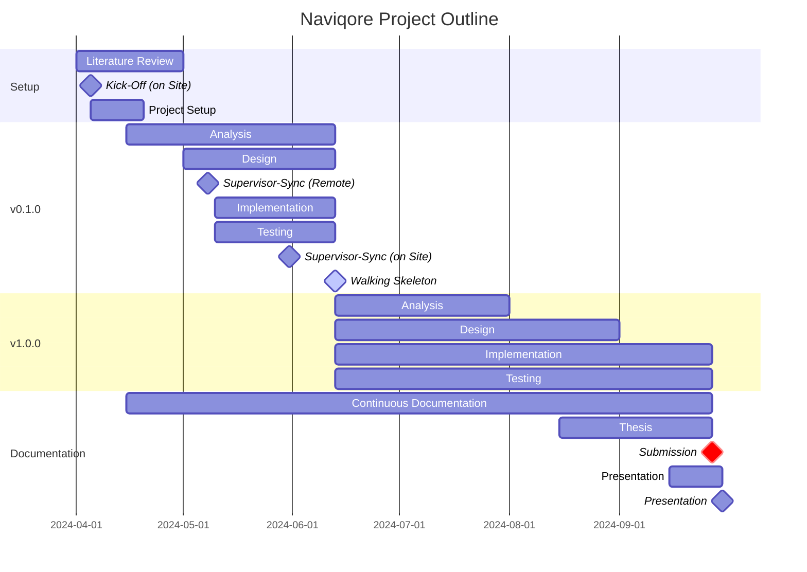

# Outline

## Project milestones

## Team resource schedule
[Link to time schedule](https://docs.google.com/spreadsheets/d/1NVJV-sXO0yzrbKqA5deLzzR0VaGW3y-0jaoxKCRQ4sk/edit?usp=sharing)

| Person  | KW10 | KW11 | KW12 | KW13 | KW14 | KW15 | KW16 | KW17 | KW18 | KW19 | KW20 | KW21 | KW22 | KW23 | KW24 | KW25 | KW26 | KW27 | KW28 | KW29 | KW30 | KW31 | KW32 | KW33 | KW34 | KW35 | KW36 | Total |
|---------|------|------|------|------|------|------|------|------|------|------|------|------|------|------|------|------|------|------|------|------|------|------|------|------|------|------|------|-------|
| Merlin  |      |      |      |      |      |      |      |      |      |      |      |      |      |      |      |      |      |      |      |      |      |      |      |      |      |      |      | 375h  |
| Lukas   |      |      |      |      |      |      |      |      |      |      |      |      |      |      |      |      |      |      |      |      |      |      |      |      |      |      |      | 375h  |
| Michael |      |      |      | V🌴  | 8h   | 4h   | 9h   | 8h   | 2h   | 20h  | 12h  | 13h  |      |      |      |      |      |      |      |      |      |      |      |      |      |      |      | 375h  |

**Code sprint**: 2024-07-18 18:00 - 2024-07-20 18:00

### Legend

| Symbol | Meaning                             |
|--------|-------------------------------------|
| KW     | Calendar Week                       |
| V🌴    | Vacation                            |
| Total  | Sum of time estimates for all weeks |

Start typing here...