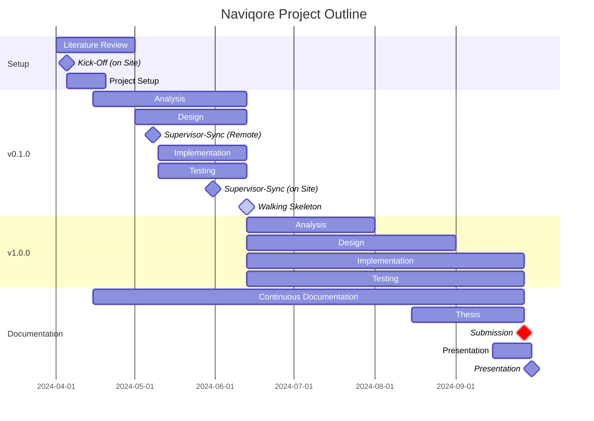

# Overview

Overview articles give background information and provide context to a particular subject.
Their goal is to explain a concept, not to teach or give instructions.

## What is product/service/concept

Provide some background and context, explain choices and alternatives.

## Glossary

A definition list or a glossary:

First Term
: This is the definition of the first term.

Second Term
: This is the definition of the second term.

## Outline

## Semantic Versioning

This project adheres to [Semantic Versioning](https://semver.org/). We use a three-part version numbering system:
MAJOR.MINOR.PATCH. Here is what each part represents:

- **MAJOR version** when we make incompatible API changes,
- **MINOR version** when we add functionality in a backwards compatible manner, and
- **PATCH version** when we make backwards compatible bug fixes.

Each release increases the version number accordingly. For more details on our versioning protocol and for updates,
please visit our release notes.

## Commit Messages
