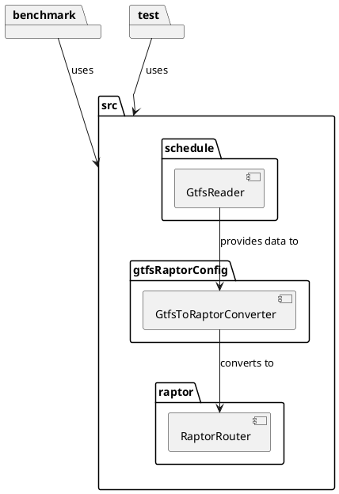
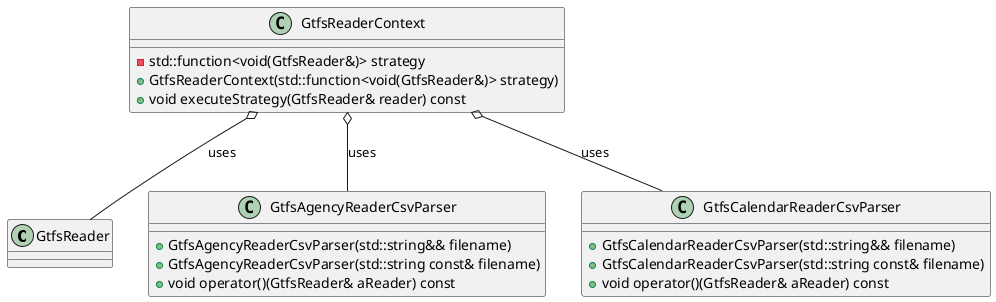
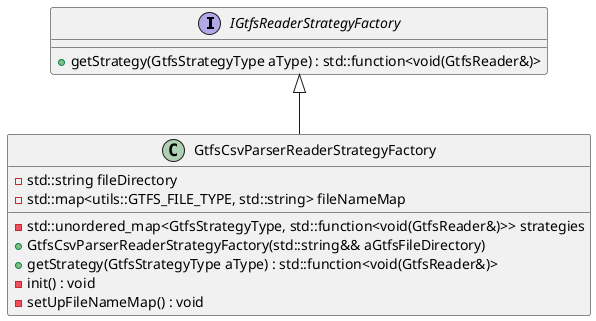

# Simple C++ RAPTOR Implementation

This section discusses the design, implementation, and optimization of a public transport routing system, developed
using modern C++20/C++23 standards. The project incorporates advanced data structures and algorithms to enable
efficient route planning, with an emphasis on cross-platform compatibility and robust build configurations via CMake.

The C++ implementation is based heavily on the [Simple Raptor](simple-raptor.md "Simple RAPTOR Implementation"), but
extends it with optimizations and modern C++ features. In this section, we focus on the C++ implementation, detailing
the key components and challenges faced during development.

The C++ implementation comprises:

1. A schedule reader.
2. A module for converting GTFS data into the RAPTOR structure.
3. A RAPTOR algorithm module.
4. A Geometry helper module
5. A wrapper of [spdlog](https://github.com/gabime/spdlog) for logging purpose



We aimed to utilize the most modern C++ features possible. Although we initially attempted to implement the project
using the new C++ module system, limited compiler support (primarily from MSVC on Windows) posed challenges.

## Challenges of Implementing in C++ Compared to Java

Implementing RaptorXX in C++ presented several challenges, particularly in comparison to Java. Below, we outline key
areas where the two languages differ, highlighting the complexities faced during C++ development.

### 1. Cross-Platform Compatibility

- **C++**: Cross-platform compatibility in C++ can be complex due to differences in compilers, libraries, and system
  calls across operating systems (e.g., Windows, Linux, macOS). Developers must account for these differences using
  conditional compilation and platform-specific code.
- **Java**: Java’s "write once, run anywhere" philosophy, backed by the JVM (Java Virtual Machine), abstracts away most
  platform-specific details, making cross-platform development more straightforward.

### 2. Standard Library (STL) Limitations

- **C++**: While the C++ Standard Library (STL) is powerful, it lacks built-in support for common tasks like logging and
  CSV parsing. To address this, developers often integrate third-party libraries such as `spdlog` for logging and
  `csv-parser` for CSV reading, which can increase project complexity.
- **Java**: Java's Standard Library is more comprehensive, offering built-in support for tasks like logging (
  `java.util.logging`) and file I/O, reducing the need for external dependencies and simplifying development.

#### Compiler Support for C++20

Not all compilers support the full range of library features. This means you have to pay attention to what features you
use so that you remain compatible.
{width="850"}

### 3. Memory Management

- **C++**: Manual memory management in C++ can result in issues such as memory leaks and buffer overflows. Developers
  need to carefully manage resource allocation and deallocation, though modern smart pointers (e.g., `std::unique_ptr`,
  `std::shared_ptr`) help mitigate these risks.
- **Java**: Java's automatic garbage collection system handles memory management, reducing the risk of memory leaks and
  simplifying development.

### 4. Error Handling

- **C++**: Error handling in C++ is typically done using exceptions, but developers must ensure exception safety and
  proper resource cleanup. Additionally, the lack of a standardized error-handling approach across different libraries
  can create inconsistencies.
- **Java**: Java's exception handling is more standardized and integrated into the language, providing a consistent
  framework for managing errors.

### 5. Build and Dependency Management

- **C++**: Building and managing dependencies in C++ projects can be labor-intensive. Tools like CMake facilitate build
  management, but additional configuration is often required. Dependency management tools such as `vcpkg` and `Conan`
  are available, but they are not as integrated or straightforward as Java’s ecosystem. we relied on vcpgk from
  microsoft [vcpkg](https://vcpkg.io/en/).
- **Java**: Java's build tools, such as Maven and Gradle, provide robust dependency management and build automation,
  streamlining the development process.

### 6. Development Tools and Ecosystem

- **C++**: The C++ ecosystem offers a wide range of tools, though their quality and ease of use can vary. Setting up
  debugging, profiling, and other development tools often requires more effort. We mainly worked with CLion from
  Jetbrains, but had to switch to Visual Studio for certain tasks.
- **Java**: Java boasts a mature ecosystem with comprehensive development tools, such as IntelliJ IDEA, which offer
  out-of-the-box support for debugging, profiling, and build automation.

### 7. Performance Considerations

- **C++**: C++ offers fine-grained control over system performance, but leveraging these optimizations requires deep
  knowledge of both the language and hardware architecture. Developers must often balance performance with code
  maintainability and readability.
- **Java**: While Java’s performance relies on the JVM, its Just-In-Time (JIT) compilation and optimization strategies
  offer competitive performance, though not always at the same level of fine-tuned C++ code.

### Conclusion

Developing a public transit routing system like RaptorXX in C++ presents unique challenges compared to Java,
especially concerning cross-platform compatibility, library support, memory management, and build complexity. While C++
offers more granular control and performance potential, it requires greater effort in managing these aspects. In
contrast, Java's comprehensive standard library, automatic memory management, and mature ecosystem can significantly
simplify development.

## Code Efficiency: Patterns and Idioms

In an effort to make the code as efficient and maintainable as possible, we employed a variety of design patterns and
modern C++ idioms. These strategies help in structuring the code for performance, clarity, and extensibility. Below are
some of the key patterns and techniques we utilized.

### Design Patterns Used

1. **Value-Based Strategy Pattern**:

- We implemented the **Value-Based Strategy Pattern** to enhance flexibility and performance in reading the GTFS data.
  This design pattern allows runtime selection of a class's behavior without relying on traditional virtual methods and
  inheritance. Instead, we use callable objects such as functors, lambdas, or `std::function` to encapsulate the
  strategy. This approach avoids the overhead of virtual function calls, leading to better performance while maintaining
  flexibility.



#### Context

```c++
class GtfsReaderContext {
  std::function<void(GtfsReader&)> strategy;

public:
  explicit GtfsReaderContext(std::function<void(GtfsReader&)> strategy)
    : strategy(std::move(strategy)) {}

  void executeStrategy(GtfsReader& reader) const {
    strategy(reader);
  }
};
```

#### Strategies

```c++
class GtfsAgencyReaderCsvParser {
  std::string filename;

public:
  explicit GtfsAgencyReaderCsvParser(std::string filename)
    : filename(std::move(filename)) {}

  void operator()(GtfsReader& aReader) const {
    // Implementation of the strategy
  }
};

class GtfsAgencyReaderCsvParser {
  std::string filename;

public:
  explicit GtfsAgencyReaderCsvParser(std::string filename)
    : filename(std::move(filename)) {}

  void operator()(GtfsReader& aReader) const {
    // Implementation of the strategy
  }
};
```

2. **Factory Pattern**:

- The factory pattern was employed to simplify the creation of complex objects, decoupling the creation logic from the
  client code. This made our codebase more modular and easier to extend, particularly when integrating new components
  without impacting existing logic.



```c++

class IGtfsReaderStrategyFactory {
public:
    virtual ~IGtfsReaderStrategyFactory() = default;
    virtual std::function<void(GtfsReader&)>& getStrategy(GtfsStrategyType aType) = 0;
};

class GtfsCsvParserReaderStrategyFactory final : public IGtfsReaderStrategyFactory {
    std::string fileDirectory;
    std::map<int, std::string> fileNameMap;
    std::unordered_map<GtfsStrategyType, std::function<void(GtfsReader&)>> strategies;

public:
    explicit GtfsCsvParserReaderStrategyFactory(/*..*/){}

    std::function<void(GtfsReader&)>& getStrategy(GtfsStrategyType aType) override {
        return strategies[aType];
    }
};

int main() {
    GtfsCsvParserReaderStrategyFactory factory("path/to/gtfs/files/");
    auto agencyStrategy = factory.getStrategy(GtfsStrategyType::AGENCY);
    GtfsReader reader;
    agencyStrategy(reader);
    
    return 0;
}
```

### Ranges-Views Library

We also leveraged the **Ranges Views** library from C++20 to optimize the handling and transformation of data
collections. The Ranges Views library provides a powerful, declarative way to work with ranges of data, such as arrays,
vectors, and other containers, without the need to manually write loops or intermediate data transformations.

#### Advantages of Ranges Views:

1. **Lazy Evaluation**:

- One of the primary advantages of Ranges Views is **lazy evaluation**. Unlike traditional containers, views are not
  eager; they do not perform operations immediately. Instead, they build a pipeline of transformations, only performing
  computations when the result is needed. This reduces unnecessary memory allocation and computation, making code both
  faster and more memory-efficient.

2. **Composability**:

- Ranges Views allow you to chain multiple operations (e.g., filtering, transforming, sorting) in a clear and concise
  manner. For example, filtering and transforming a collection can be expressed in a single statement, avoiding the need
  for temporary variables or extra copies of data. This composability leads to cleaner, more readable code, reducing the
  risk of errors during iteration and transformation.

3. **Improved Expressiveness**:

- Traditional loops can obscure the intent of a block of code, especially in complex transformations. With Ranges Views,
  the code becomes more expressive, focusing on **what** is being done (e.g., filtering, mapping) rather than **how**
  it’s being done (i.e., the loop mechanics). This declarative approach improves code readability and maintainability.

4. **Avoiding Intermediate Copies**:

- Using traditional approaches often involves creating intermediate collections when performing operations like
  filtering and transforming. With Ranges Views, transformations occur on the original range without creating new
  containers or copies unless explicitly needed, thereby improving both memory and runtime efficiency.

#### Example Usage of Ranges Views in Our Code

In our implementation, Ranges Views allowed us to simplify complex operations like filtering trips, sorting schedules,
or transforming datasets. For example:

```c++
const auto servedDates = data->calendarDates
                             | std::views::values
                             | std::views::join
                             | std::views::filter([this, &localDateTime](const std::shared_ptr<schedule::gtfs::CalendarDate>& date) {
                                 return this->isServiceAvailable(date->serviceId, localDateTime);
                               })
                             | std::views::transform([](const std::shared_ptr<schedule::gtfs::CalendarDate>& date) {
                                 return date->serviceId;
                               })
                             | std::ranges::to<std::set<std::string>>();

```

### Profiling

## Visual Studio Diagnostic Tools

We used the Visual Studio Diagnostic Tool to analyze performance.
The **Visual Studio Diagnostic Tools** are a powerful set of profiling and debugging features integrated into the Visual
Studio IDE. These tools allow developers to monitor, analyze, and optimize the performance of their applications,
including C++ code. By leveraging these tools, you can gain deeper insights into how your program behaves at runtime,
helping you identify and resolve performance bottlenecks and resource management issues.

### Key Features for C++ Code

1. **Performance Profiling**:

- The profiling tools provide detailed performance metrics such as CPU usage, memory allocation, and execution time of
  different code sections. This helps in identifying functions or loops that consume excessive processing time or
  memory.

2. **Memory Usage Analysis**:

- The diagnostic tools track memory allocations in the running C++ application. This is especially useful for detecting
  memory leaks, inefficient memory usage, or unexpected allocations, ensuring the program remains efficient and stable.

3. **CPU Usage**:

- The CPU usage tool allows to see how much processing time the code consumes, and which parts of the code are
  responsible for high CPU loads. This enables to focus optimization efforts on the most critical areas.

- [Optimizing Code Using Profiling Tools](https://learn.microsoft.com/en-us/visualstudio/profiling/optimize-code-using-profiling-tools?view=vs-2022&source=recommendations).

(compiler_support.png){width="850"}
{width="850"}

## Foreign Function and Memory (FFM) API

Initially, we explored the possibility of calling the C++ RAPTOR implementation from Java using the Foreign Function and
Memory (FFM) API. However, due to the complexity of mapping intricate data structures between C++ and Java, we
ultimately decided not to pursue this implementation.

### Challenges and C Compatibility

Integrating C++ code with Java through the FFM API presents several technical challenges. Below are the key difficulties
we encountered:

#### 1. Memory Management

Managing off-heap memory in Java can be challenging when working with native code. The FFM API offers the
`MemorySegment` and `Arena` classes to facilitate memory management, allowing developers to allocate and deallocate
native memory efficiently. However, improper handling of this off-heap memory can lead to memory leaks or crashes.
Developers need to ensure memory management practices to avoid such issues.

#### 2. Data Conversion

Converting data between Java and native C types is another significant hurdle. The FFM API provides `ValueLayout`
classes to define the memory layout of data types in both Java and native code. However, ensuring that these layouts
match the exact structure of the native code (C++) requires careful attention. In complex data structures, especially
those with pointers or custom layouts, mismatches can result in runtime errors or undefined behavior.

#### 3. Error Handling

Error handling becomes more difficult when working with native code. Bugs or faults in C++ code can cause the JVM to
crash, making debugging a more complicated process. While Java provides robust error handling, diagnosing issues in
native code may require external tools such as native debuggers, core dumps, and more intricate diagnostic setups. This
introduces additional overhead during development and testing.

#### 4. Platform Differences

Although the FFM API abstracts some platform-specific details, developers must still account for differences in calling
conventions and memory layouts between platforms (e.g., Windows vs. Linux). These differences can introduce subtle bugs
or performance issues when deploying the same Java code across different operating systems. Cross-platform compatibility
must be thoroughly tested to avoid such pitfalls.

### Conclusion (FFM)

The Foreign Function and Memory API in Java provides powerful capabilities for integrating Java applications with native
C or C++ code. However, it introduces several complexities in memory management, data conversion, error handling, and
cross-platform compatibility. A deep understanding of both the Java and native environments, along with careful
management of these aspects, is essential for successful and stable integration.

```c++
#include <iostream>

extern "C" {
    __declspec(dllexport) int addNumbers(int a, int b) {
        return a + b;
    }
}
```

```java
import java.lang.foreign.*;
import java.lang.invoke.MethodHandle;

public class NativeAdder {
    public static void main(String[] args) throws Throwable {
        System.load("path/to/library.dll");

        Linker linker = Linker.nativeLinker();
        SymbolLookup lookup = SymbolLookup.loaderLookup();

        MemorySegment addNumbersSymbol = lookup.find("addNumbers").orElseThrow();
        MethodHandle addNumbers = linker.downcallHandle(addNumbersSymbol,
                FunctionDescriptor.of(ValueLayout.JAVA_INT, ValueLayout.JAVA_INT, ValueLayout.JAVA_INT));

        int result = (int) addNumbers.invoke(10, 15);
        System.out.println("Result of addNumbers(10, 15): " + result);
    }
}
```
