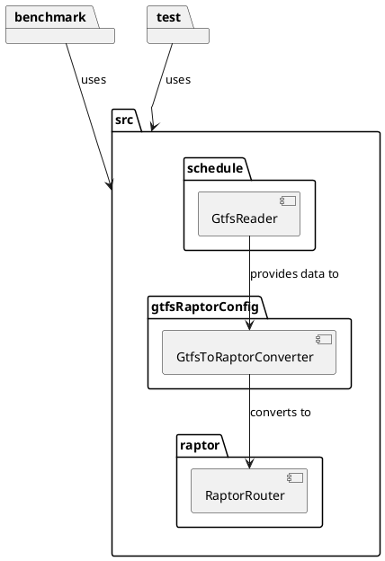
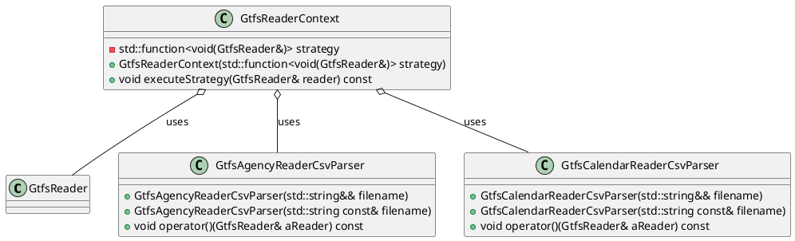
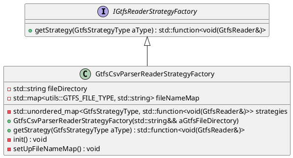

# Simple C++ RAPTOR Implementation

This section discusses the design, implementation, and optimization of a public transport routing system, developed
using modern C++20/C++23 standards. The project incorporates advanced data structures and algorithms to enable
efficient route planning, with an emphasis on cross-platform compatibility and robust build configurations via CMake.

The C++ implementation is heavily inspired by the [Simple Raptor](simple-raptor.md "Simple RAPTOR Implementation") and
utilizes modern C++ features. This section focuses on the C++ implementation, detailing the key components and
challenges encountered during development.

The C++ implementation comprises:

1. A schedule reader.
2. A module for converting GTFS data into the RAPTOR structure.
3. A RAPTOR algorithm module.
4. A Geometry helper module
5. A wrapper of [spdlog](https://github.com/gabime/spdlog) for logging purpose



We aimed to utilize the most modern C++ features possible. Although we initially attempted to implement the project
using the new C++ module system, limited compiler support (primarily from MSVC on Windows) posed challenges.

## Challenges of Implementing in C++

The implementation of RaptorXX in C++ was undertaken with the aim of achieving better performance compared to Java.
However, this proved to be a challenging endeavor due to the highly optimized nature of Java's JVM, which often achieves
excellent performance through Just-In-Time (JIT) compilation and other optimization strategies. In the following, we
outline the complex areas that need to be considered when developing C++.

Ensuring cross-platform compatibility in C++ is complex due to differences in compilers, libraries, and system calls
across operating systems (e.g., Windows, Linux, macOS). Developers must use conditional compilation and
platform-specific code to address these differences. The C++ Standard Library (STL) lacks built-in support for common
tasks like logging and CSV parsing. Developers often integrate third-party libraries such as `spdlog` for logging and
`csv-parser` for CSV reading, increasing project complexity. Not all compilers support the full range of C++20 features.
Developers must pay attention to feature compatibility to ensure cross-platform support.

Manual memory management in C++ can lead to issues such as memory leaks and buffer overflows. Developers need to
carefully manage resource allocation and deallocation, though modern smart pointers (e.g., `std::unique_ptr`,
`std::shared_ptr`) help mitigate these risks. Error handling in C++ is typically done using exceptions, but developers
must ensure exception safety and proper resource cleanup.

Building and managing dependencies in C++ projects can be labor-intensive. Tools like CMake facilitate build management,
but additional configuration is often required. Dependency management tools such as `vcpkg` and `Conan` are available
but are not as integrated or straightforward as Java’s ecosystem. We relied on `vcpkg` from Microsoft. The C++ ecosystem
offers a wide range of tools, though their quality and ease of use can vary. Setting up debugging, profiling, and other
development tools often requires more effort. We mainly worked with CLion from JetBrains but had to switch to Visual
Studio for certain tasks.

While C++ offers fine-grained control over system performance, leveraging these optimizations requires deep knowledge of
both the language and hardware architecture. Developers must often balance performance with code maintainability and
readability.

### Conclusion - JAVA vs C++ Performance

In our development of the public transit routing system RaptorXX, we aimed to leverage the performance advantages of
C++. However, our analysis indicated that while C++ is indeed faster in several cases, Java's performance is
impressively close. The Java Virtual Machine (JVM) optimizations, along with its automatic memory management and
just-in-time compilation, enabled Java to execute routing requests with competitive efficiency.

The testing results showed that C++ performed better in many scenarios, often demonstrating lower elapsed times.
However, Java consistently delivered strong performance, falling just short in a few cases. This indicates that,
although C++ can offer high performance with fine-grained control over system resources, achieving that performance
requires careful management of various factors, such as memory allocation and data structure handling.

Additionally, potential inefficiencies or errors in the C++ implementation can affect overall performance. The
challenges of adapting the C++ code to align with Java's memory layout further complicate the process.

Ultimately, while C++ presents a powerful option for high-performance applications, Java's optimizations and robust
ecosystem often provide a more practical and reliable solution for our routing needs. This highlights that sometimes
high-level abstractions can lead to results that are not only competitive in speed but also more manageable in terms of
development and maintenance.

| From Stop                              | To Stop                             | Iterations | Java Elapsed Time (ms) | C++ Elapsed Time (ms) | Difference (ms) | Difference (%) |
|----------------------------------------|-------------------------------------|------------|------------------------|-----------------------|-----------------|----------------|
| 8589640 (St. Gallen, Vonwil)           | 8579885 (Mels, Bahnhof)             | 100        | 13                     | 19                    | -6              | -31.6%         |
| 8574563 (Maienfeld, Bahnhof)           | 8587276 (Biel/Bienne, Taubenloch)   | 100        | 55                     | 38                    | 17              | 44.7%          |
| 8588524 (Sion, Hôpital Sud)            | 8508896 (Stans, Bahnhof)            | 100        | 45                     | 20                    | 25              | 125.0%         |
| 8510709 (Lugano, Via Domenico Fontana) | 8579255 (Lausanne, Pont-de-Chailly) | 100        | 46                     | 29                    | 17              | 58.6%          |
| 8574848 (Davos Dorf, Bahnhof)          | 8576079 (Rapperswil SG, Sonnenhof)  | 100        | 12                     | 15                    | -3              | -20.0%         |

**Summary of Differences**

The "Difference (ms)" column reflects the absolute time difference in milliseconds between Java and C++ for each routing
request. A negative value indicates that Java was faster than C++, while a positive value shows that C++ performed
better.

The "Difference (%)" column presents the percentage difference in performance between Java and C++. Positive percentages
indicate that C++ performed better (was faster), while negative percentages indicate instances where Java was faster.

```tex
\frac{{\text{{Java Elapsed Time}} - \text{{C++ Elapsed Time}}}}{{\text{{Java Elapsed Time}}}} \times 100
 ```

## Code Efficiency: Patterns and Idioms

In an effort to make the code as efficient and maintainable as possible, we employed a variety of design patterns and
modern C++ idioms. These strategies help in structuring the code for performance, clarity, and extensibility. Below are
some of the key patterns and techniques we utilized.

### Design Patterns Used

1. **Value-Based Strategy Pattern (GTFS-Reader)**:

- We implemented the **Value-Based Strategy Pattern** to enhance flexibility and performance in reading the GTFS data.
  This design pattern allows runtime selection of a class's behavior without relying on traditional virtual methods and
  inheritance. Instead, we use callable objects such as functors, lambdas, or `std::function` to encapsulate the
  strategy. This approach avoids the overhead of virtual function calls, leading to better performance while maintaining
  flexibility.



#### Context

```c++
class GtfsReaderContext {
  std::function<void(GtfsReader&)> strategy;

public:
  explicit GtfsReaderContext(std::function<void(GtfsReader&)> strategy)
    : strategy(std::move(strategy)) {}

  void executeStrategy(GtfsReader& reader) const {
    strategy(reader);
  }
};
```

#### Strategies

```c++
class GtfsAgencyReaderCsvParser {
  std::string filename;

public:
  explicit GtfsAgencyReaderCsvParser(std::string filename)
    : filename(std::move(filename)) {}

  void operator()(GtfsReader& aReader) const {
    // Implementation of the strategy
  }
};

class GtfsAgencyReaderCsvParser {
  std::string filename;

public:
  explicit GtfsAgencyReaderCsvParser(std::string filename)
    : filename(std::move(filename)) {}

  void operator()(GtfsReader& aReader) const {
    // Implementation of the strategy
  }
};
```

2. **Factory Pattern (GTFS-Reader)**:

- The factory pattern was employed to simplify the creation of complex objects, decoupling the creation logic from the
  client code. This made our codebase more modular and easier to extend, particularly when integrating new components
  without impacting existing logic.



```c++

class IGtfsReaderStrategyFactory {
public:
    virtual ~IGtfsReaderStrategyFactory() = default;
    virtual std::function<void(GtfsReader&)>& getStrategy(GtfsStrategyType aType) = 0;
};

class GtfsCsvParserReaderStrategyFactory final : public IGtfsReaderStrategyFactory {
    std::string fileDirectory;
    std::map<int, std::string> fileNameMap;
    std::unordered_map<GtfsStrategyType, std::function<void(GtfsReader&)>> strategies;

public:
    explicit GtfsCsvParserReaderStrategyFactory(/*..*/){}

    std::function<void(GtfsReader&)>& getStrategy(GtfsStrategyType aType) override {
        return strategies[aType];
    }
};

int main() {
    GtfsCsvParserReaderStrategyFactory factory("path/to/gtfs/files/");
    auto agencyStrategy = factory.getStrategy(GtfsStrategyType::AGENCY);
    GtfsReader reader;
    agencyStrategy(reader);
    
    return 0;
}
```

### Ranges-Views Library

We also leveraged the **Ranges Views** library from C++20 to optimize the handling and transformation of data
collections. The Ranges Views library provides a powerful, declarative way to work with ranges of data, such as arrays,
vectors, and other containers, without the need to manually write loops or intermediate data transformations.

#### Advantages of Ranges Views:

1. **Lazy Evaluation**:

- One of the primary advantages of Ranges Views is **lazy evaluation**. Unlike traditional containers, views are not
  eager; they do not perform operations immediately. Instead, they build a pipeline of transformations, only performing
  computations when the result is needed. This reduces unnecessary memory allocation and computation, making code both
  faster and more memory-efficient.

2. **Composability**:

- Ranges Views allow you to chain multiple operations (e.g., filtering, transforming, sorting) in a clear and concise
  manner. For example, filtering and transforming a collection can be expressed in a single statement, avoiding the need
  for temporary variables or extra copies of data. This composability leads to cleaner, more readable code, reducing the
  risk of errors during iteration and transformation.

3. **Improved Expressiveness**:

- Traditional loops can obscure the intent of a block of code, especially in complex transformations. With Ranges Views,
  the code becomes more expressive, focusing on **what** is being done (e.g., filtering, mapping) rather than **how**
  it’s being done (i.e., the loop mechanics). This declarative approach improves code readability and maintainability.

4. **Avoiding Intermediate Copies**:

- Using traditional approaches often involves creating intermediate collections when performing operations like
  filtering and transforming. With Ranges Views, transformations occur on the original range without creating new
  containers or copies unless explicitly needed, thereby improving both memory and runtime efficiency.

#### Example Usage of Ranges Views in Our Code

In our implementation, Ranges Views allowed us to simplify complex operations like filtering trips, sorting schedules,
or transforming datasets. For example:

```c++
const auto servedDates = data->calendarDates
                             | std::views::values
                             | std::views::join
                             | std::views::filter([this, &localDateTime](const std::shared_ptr<schedule::gtfs::CalendarDate>& date) {
                                 return this->isServiceAvailable(date->serviceId, localDateTime);
                               })
                             | std::views::transform([](const std::shared_ptr<schedule::gtfs::CalendarDate>& date) {
                                 return date->serviceId;
                               })
                             | std::ranges::to<std::set<std::string>>();

```

### Profiling

## Visual Studio Diagnostic Tools

We used the Visual Studio Diagnostic Tool to analyze performance and to improve the efficiency of our C++ code.
The **Visual Studio Diagnostic Tools** are a powerful set of profiling and debugging features integrated into the Visual
Studio IDE. These tools allow developers to monitor, analyze, and optimize the performance of their applications,
including C++ code. By leveraging these tools, you can gain deeper insights into how your program behaves at runtime,
helping you identify and resolve performance bottlenecks and resource management issues.

### Performance Analysis in RaptorXX

The Visual Studio Diagnostic Tools were utilized to analyze and optimize the performance of the RaptorXX project.

- **Performance Profiling**: Provides detailed metrics such as CPU usage, memory allocation, and execution time, helping
  identify performance bottlenecks.
- **Memory Usage Analysis**: Tracks memory allocations to detect leaks, inefficient usage, or unexpected allocations,
  ensuring stability.
- **CPU Usage**: Monitors CPU load to focus optimization efforts on critical code areas.

- [Optimizing Code Using Profiling Tools](https://learn.microsoft.com/en-us/visualstudio/profiling/optimize-code-using-profiling-tools?view=vs-2022&source=recommendations).

(compiler_support.png){width="850"}
{width="850"}

## Foreign Function and Memory (FFM) API

Initially, we explored the possibility of calling the C++ RAPTOR implementation from Java using the Foreign Function and
Memory (FFM) API. However, we faced significant challenges due to the complexity of mapping intricate data structures
between C++ and Java. Ultimately, we decided against this approach.

The FFM API was not well-suited for our application. Sending routing requests from Java to C++ required C++ to operate
on a memory layout for the schedule built in Java. Since Java would be the only active application, rebuilding the
schedule from files in C++ for each request proved to be inefficient. A more effective solution would have involved
implementing a C++ service that Java could call for routing needs. The FFM API is better suited for replacing complex
functions rather than managing entire packages, making it unsuitable for our requirements.

### Example implementation for using the FFM API and C / C++

```c++
#include <iostream>

extern "C" {
    __declspec(dllexport) int addNumbers(int a, int b) {
        return a + b;
    }
}
```

```java
import java.lang.foreign.*;
import java.lang.invoke.MethodHandle;

public class NativeAdder {
    public static void main(String[] args) throws Throwable {
        System.load("path/to/library.dll");

        Linker linker = Linker.nativeLinker();
        SymbolLookup lookup = SymbolLookup.loaderLookup();

        MemorySegment addNumbersSymbol = lookup.find("addNumbers").orElseThrow();
        MethodHandle addNumbers = linker.downcallHandle(addNumbersSymbol,
                FunctionDescriptor.of(ValueLayout.JAVA_INT, ValueLayout.JAVA_INT, ValueLayout.JAVA_INT));

        int result = (int) addNumbers.invoke(10, 15);
        System.out.println("Result of addNumbers(10, 15): " + result);
    }
}
```
