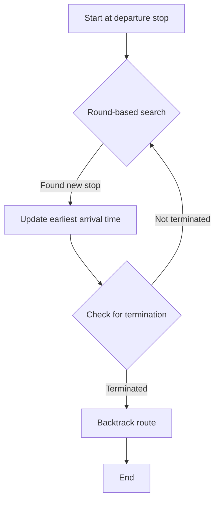

# RaptorAnalysis

The RAPTOR (Round-based Public Transit Routing) algorithm is an algorithm for calculating the
optimal route in a public transportation system.
It was specially developed to quickly and efficiently find the best routes in large and complex
transportation networks.

**Initialization**: the algorithm begins at the start station at the given start time.
It initializes a list of stations
that it will visit in this round (initially only the start station) and a list of already
visited stations.

**Round-based search**: The algorithm performs several "rounds" of the search. In each round,
it considers all transport
lines that stop at the stations of the current round. For each line,
it calculates the earliest arrival time at each
station along the line that has not yet been visited and adds these stations to the list for
the next round.

**Updating the arrival times**: When the algorithm finds a new stop,
it updates the earliest arrival time at this stop. If
the new arrival time is earlier than the previous one, the route is updated.

**Check for termination**: The algorithm ends when it has reached the destination station and
there are no more stations to
visit in the current lap, or when a certain number of laps have been completed.

**Tracing the route**: After the algorithm has finished, the optimal route can be found by
backtracking the updated arrival
times from the destination station to the start station.

The **RAPTOR** algorithm is very efficient because it takes advantage of the fact that public
transportation systems usually have regular schedules and that it is often faster to stay on
the same line instead of switching. It is particularly well suited for real-time
routing and planning in large transportation networks.

### Flowchart



- The algorithm starts at the departure stop at the given departure time. It initializes a list of stops to visit in
  this round (initially just the departure stop), and a list of already visited stops.
- The algorithm performs several "rounds" of search. In each round, it considers all transit lines that stop at the
  stops in the current round. For each line, it calculates the earliest arrival time at each stop along the line that
  hasn't been visited yet, and adds these stops to the list for the next round.
- When the algorithm finds a new stop, it updates the earliest arrival time at this stop. If the new arrival time is
  earlier than the previous one, it updates the route.
- After the algorithm has terminated, the optimal route can be found by backtracking the updated arrival times from the
  destination stop to the departure stop.

### simplified python example

```Python
class Stop:
    def __init__(self, name):
        self.name = name
        self.earliest_arrival = float('inf')
        self.visited = False

class Line:
    def __init__(self, stops):
        self.stops: List[Stop] = stops

def raptor(departure, destination, lines):

    departure.earliest_arrival = 0

    stops_to_visit = [departure]
    while stops_to_visit:
        next_stops_to_visit = []
        for stop in stops_to_visit:
            stop.visited = True
            for line in lines:
                if stop in line.stops:
                    for next_stop in line.stops:
                        if not next_stop.visited:
                            next_stop.earliest_arrival = min(
                            next_stop.earliest_arrival, 
                            stop.earliest_arrival + 1)
                            next_stops_to_visit.append(next_stop)
        stops_to_visit = next_stops_to_visit

    route = [destination]
    current_stop = destination
    while current_stop != departure:
        for line in lines:
            if current_stop in line.stops:
                for prev_stop in line.stops:
                    if prev_stop.earliest_arrival 
                        == current_stop.earliest_arrival - 1:
                        route.append(prev_stop)
                        current_stop = prev_stop
                        break
    route.reverse()

    return route
```