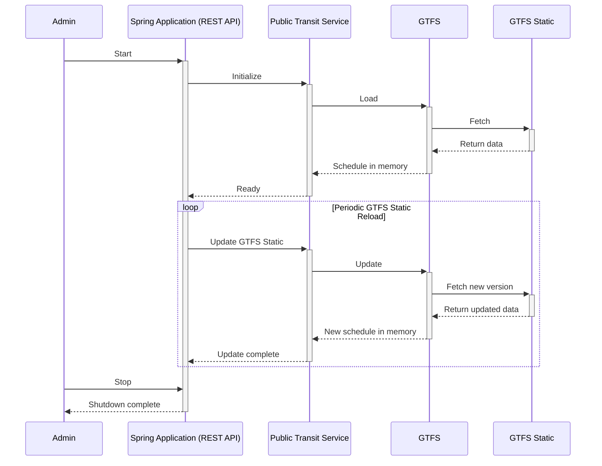
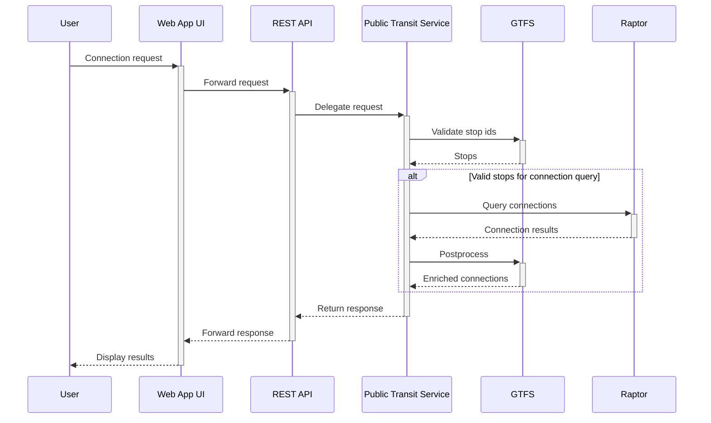

# Sequence Diagram

The following sequence diagrams illustrate the key interactions and processes within the Naviqore system.

## Application Startup

This sequence diagram illustrates how the backend Spring application (REST API) initializes during the startup of the
Naviqore system. Upon startup, the **Public Transit Service** loads the **GTFS Static** schedule either from a file or a
URL. While running the service periodically updates the **GTFS Static** schedule from the given source.

## Connection Request

This sequence diagram illustrates how the Naviqore system processes a connection request by a user. The system first
validates whether the requested stops are valid and retrieves parent or child stops if any. If the stops are valid,
the **Raptor** is used to query connections, and the connection results are enriched with information from the
**GTFS** before being returned to the user.

