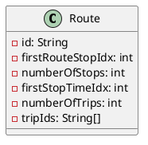

# Simple RAPTOR Implementation

The RAPTOR (Round-based Public Transit Optimized Router) algorithm is a public transit routing algorithm designed for
efficiently computing the fastest routes through a public transit network. This algorithm was initially implemented in
Java as part of the early versions of this project (v0.1.0+), inspired by the work of Delling et al. The implementation
relies on a series of well-structured data arrays that optimize route traversal and trip selection, as detailed in the
appendix of their publication.

## RAPTOR Builder

To streamline the construction of the data structures proposed by Delling et al., a builder object was developed. This
builder facilitated the inclusion of all active trips in a schedule for a specific service day. The process involved
deriving the relevant routes, stops, stop times, and transfers from these active trips. Once all active objects were
defined, they were sorted, and the proposed lookup arrays were instantiated.

*Note: In the initial RAPTOR implementation, only stops served on the specific date for which the RAPTOR was built were
included in the lookup objects. This approach was later modified in the extended implementation to incorporate all
stops, regardless of service on the specific date.*

## Data Structures

The core data structures were implemented through the `RaptorData` interface, which is designed to return three primary
records, each containing more detailed structures. These data structures were optimized with memory locality in mind to
enhance routing performance. Instead of maintaining collections of object references—which would lead to scattered
memory usage—the design involves storing indexes that cross-reference relevant objects across different arrays.

### Route Traversal

For efficient route traversal during the algorithm's route scanning loop, the following data structures are utilized:

- **Routes Array**: Each entry corresponds to a specific route and includes:
    - The number of trips associated with the route.
    - The number of stops in the route (identical for all its trips).
    - Pointers to two lists: one representing the sequence of stops along the route and another for the list of all
      trips operating on that route (stop times).

- **RouteStops Array**: Instead of maintaining separate lists of stops for each route, all stops are stored in a single
  array. Each route's stops are stored consecutively, with pointers in the `Route` object indicating the starting
  position for each route's stops.

- **StopTimes Array**: This array contains the trip times (arrival and departure) for each route, organized into blocks
  by route and sorted by departure time. Within a block, the trips are sorted by their departure times from the first
  stop on the route.

### Stop Information

To support operations outside of the root scanning loop, the following structures are used:

- **Stops Array**: This array contains information about each stop, including:
    - A list of all routes that serve the stop, crucial for route traversal and improvement operations.
    - A list of all foot-paths (transfers) that can be taken from the stop, along with their corresponding transfer
      times.

- **StopRoutes Array**: Aggregates the routes associated with each stop into a single array, ensuring efficient access
  during the algorithm's execution.

- **Transfers Array**: Aggregates all foot-paths available from each stop, along with their corresponding transfer
  times, into a single array.

By organizing these data structures in contiguous memory blocks, the implementation ensures efficient access and
processing, critical for the performance of the RAPTOR algorithm.

### Look Up

This record contains two maps that link the ID (type `String`) of a stop or route to the index in the
corresponding `stops` array (part of `StopContext`) or `routes` array (part of `RouteTraversal`). This setup enables
quick access to the `Stop` or `Route` objects.

This is used for pre- and post-processing routing requests. Requests are made using stop ids and the requestor expects
ids to be returned, since internal index numbers are not visible outside of the raptor implementation.

### Stop Times Array

As mentioned earlier, the Stop Times array is the largest and most frequently used data structure in the RAPTOR
algorithm. Optimizing this data structure was crucial for performance. For reference, the size of a typical Stop Times
array in a RAPTOR instance derived from a GTFS schedule for Switzerland is approximately 8,000,000 elements, or about 32
MB. While this is a significant amount, it is already highly compact compared to the original GTFS `stop_times.txt`
file, which has a size of around 1,200 MB and essentially contains the same information.

This compactness is achieved primarily by sorting all the information during the `RaptorBuilder` process, thereby
reducing the need for referencing IDs for each stop time. However, the high degree of information compression makes
referencing stop times slightly more complex, which requires further explanation.

{ width="800" }

The Stop Times array consists of pairs of integer values representing the arrival and departure times for a given stop
on a given trip of a given route. In the example shown in the graphic above, Route 1 consists of a sequence of three
stops (Stop 1, Stop 2, and Stop 3). The route is operated 5 times (Trip 1-5), and each trip is represented by three
pairs of arrival/departure times. Other routes may follow Route 1 in the Stop Times array; however, routes are never
mixed inside the array, and trips within a route are always sorted from earliest to latest.

This layout allows efficient scanning of departures from a given stop using the `Route` object, as we can iterate over
all trips.

#### Example

Suppose we are looking for the earliest possible departure from Stop 2 on Route 1 after 8:15 am. Trip 1 departs from
Stop 2 at 07:00 am, Trip 2 at 08:00 am, and Trip 3 at 09:00 am, and so on.

To retrieve the departure time of Trip 1 at Stop 2, the following values are needed:

- **firstStopTimeIdx**: Retrieved from the `Route` object
- **stopOffset**: The (n-1)th stop in the route (for Stop 2, this would be 1)
- **tripOffset**: The (n-1)th trip of the route (for Trip 1, this would be 0)
- **numberOfStops**: Retrieved from the `Route` object (necessary for skipping between trips)

The index in the Stop Times array can then be calculated using the following formula:

`index = firstStopTimeIdx + 2 * (tripOffset * numberOfStops + stopOffset) + 1`

The `2 *` is necessary because the array contains both arrival and departure times for each stop. The `+ 1` is required
because we want to retrieve the departure time, which is the second element of the arrival/departure pair.

When accessing `stopTimes[index]`, this will return 07:00 am. Since we are looking for the earliest departure after 08:
15 am, we know we need to look further into the future. This can be done by incrementing the trip offset by `+1`. The
second lookup will still be too early, but when the trip offset is incremented to `2`, the result will be 09:00 am,
which is the earliest possible departure after 08:15 am.

It is important to note that incrementing the trip offset should only continue while the trip offset is smaller
than `numberOfTrips` to prevent accessing departures from a different route. Typically, this process would be handled
within a `while` loop.
