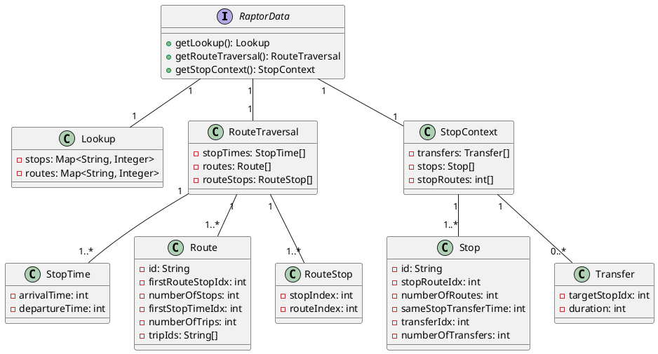
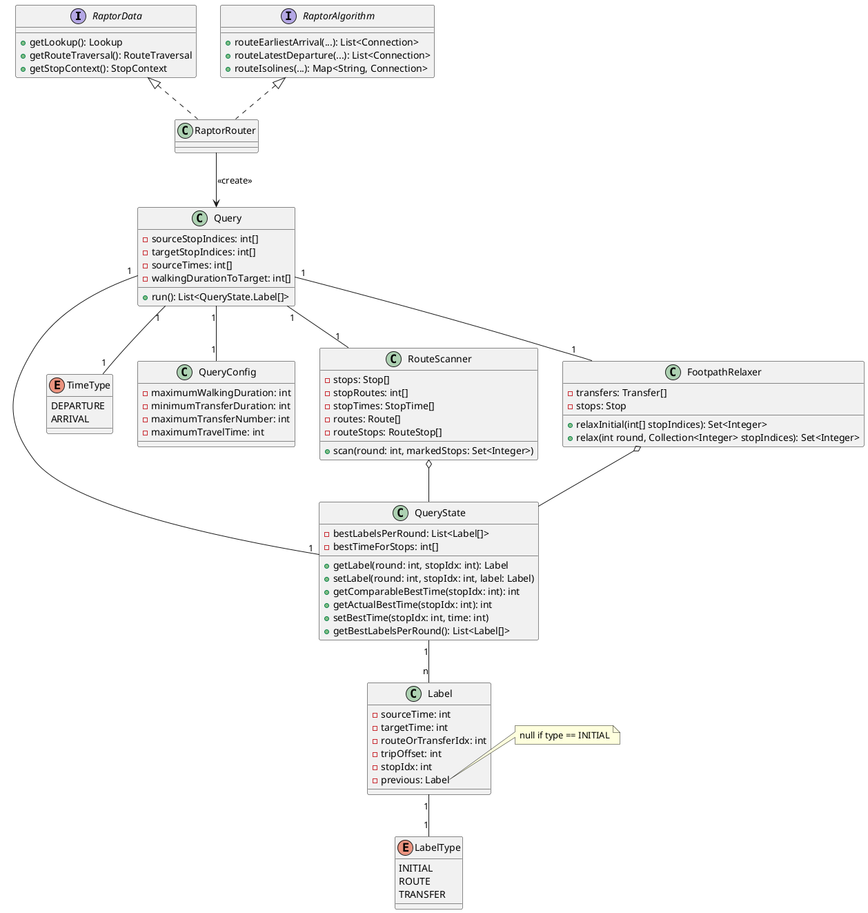
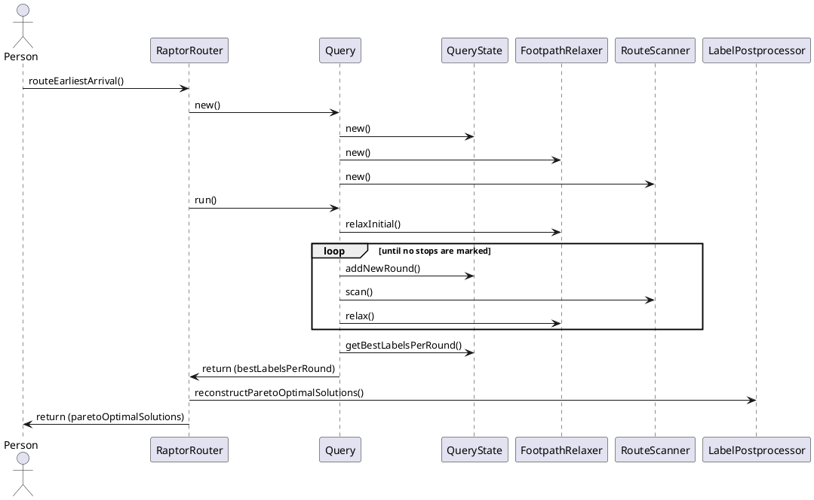

# Simple RAPTOR Implementation

The RAPTOR (Round-based Public Transit Optimized Router) algorithm is a public transit routing algorithm designed for
efficiently computing the fastest routes through a public transit network. This algorithm was initially implemented in
Java as part of the early versions of this project (v0.1.0+), inspired by the work of Delling et al. The implementation
relies on a series of well-structured data arrays that optimize route traversal and trip selection, as detailed in the
appendix of their publication.

## RAPTOR Builder

To streamline the construction of the data structures proposed by Delling et al., a builder object was developed. This
builder facilitated the inclusion of all active trips in a schedule for a specific service day. The process involved
deriving the relevant routes, stops, stop times, and transfers from these active trips. Once all active objects were
defined, they were sorted, and the proposed lookup arrays were instantiated.

*Note: In the initial RAPTOR implementation, only stops served on the specific date for which the RAPTOR was built were
included in the lookup objects. This approach was later modified in the extended implementation to incorporate all
stops, regardless of service on the specific date.*

## Data Structures

The core data structures were implemented through the `RaptorData` interface, which is designed to return three primary
records, each containing more detailed structures. These data structures were optimized with memory locality in mind to
enhance routing performance. Instead of maintaining collections of object references—which would lead to scattered
memory usage—the design involves storing indexes that cross-reference relevant objects across different arrays.

### Route Traversal

For efficient route traversal during the algorithm's route scanning loop, the following data structures are utilized:

- **Routes Array**: Each entry corresponds to a specific route and includes:
    - The number of trips associated with the route.
    - The number of stops in the route (identical for all its trips).
    - Pointers to two lists: one representing the sequence of stops along the route and another for the list of all
      trips operating on that route (stop times).

- **RouteStops Array**: Instead of maintaining separate lists of stops for each route, all stops are stored in a single
  array. Each route's stops are stored consecutively, with pointers in the `Route` object indicating the starting
  position for each route's stops.

- **StopTimes Array**: This array contains the trip times (arrival and departure) for each route, organized into blocks
  by route and sorted by departure time. Within a block, the trips are sorted by their departure times from the first
  stop on the route.

### Stop Information

To support operations outside of the root scanning loop, the following structures are used:

- **Stops Array**: This array contains information about each stop, including:
    - A list of all routes that serve the stop, crucial for route traversal and improvement operations.
    - A list of all foot-paths (transfers) that can be taken from the stop, along with their corresponding transfer
      times.

- **StopRoutes Array**: Aggregates the routes associated with each stop into a single array, ensuring efficient access
  during the algorithm's execution.

- **Transfers Array**: Aggregates all foot-paths available from each stop, along with their corresponding transfer
  times, into a single array.

By organizing these data structures in contiguous memory blocks, the implementation ensures efficient access and
processing, critical for the performance of the RAPTOR algorithm.

### Look Up

This record contains two maps that link the ID (type `String`) of a stop or route to the index in the
corresponding `stops` array (part of `StopContext`) or `routes` array (part of `RouteTraversal`). This setup enables
quick access to the `Stop` or `Route` objects.

This is used for pre- and post-processing routing requests. Requests are made using stop ids and the requestor expects
ids to be returned, since internal index numbers are not visible outside of the raptor implementation.

## Router

The `RaptorRouter` implementation integrates both the `RaptorAlgorithm` interface, which handles routing operations, and
the `RaptorData` interface, which stores all relevant data required for routing. This dual implementation ensures
that `RaptorRouter` not only provides the necessary algorithmic logic for finding routes but also maintains access to
the essential data needed to perform these operations efficiently.

### Query Object Creation and Route Calculation

Upon receiving a routing request, a new `Query` object is instantiated. The route calculation is then initiated by
invoking the `run()` method on this `Query` object. The `Query` object plays a central role in the routing process, as
it contains references to several crucial components:

- **QueryState**: This object stores all the labels generated during the routing process. It also tracks the best times
  for each stop, which are crucial for determining optimal routes.
- **RouteScanner**: This component handles everything related to scanning routes. It processes the routes based on the
  current state and round, marking relevant stops as needed.
- **FootpathRelaxer**: This object is used to evaluate possible transfers between stops. It checks if walking paths and
  transfers can be utilized to improve the route.

### Handling `routeIsolines()`

The `routeIsolines()` method uses the same `run()` method as regular route calculations, but with one key difference:
the `targetStops` are not defined in the `Query` object. Because of this, the usual comparison of routing labels against
the best times for stops does not occur, allowing for a more generalized exploration of possible routes without focusing
on specific destination stops.

### Class Diagramm

### Sequence Diagram

### Label Post Processing

The `LabelPostprocessor` class is responsible for post-processing the results of the Raptor algorithm by reconstructing
connections from the labels generated during the routing process. It uses the labels from each round of the algorithm to
build meaningful connections, which can then be returned as a list of routes or isolines.

#### Key Functions of the `LabelPostprocessor`

1. **Initialization**:
   The `LabelPostprocessor` class takes a `RaptorData` instance as input during initialization, allowing it to access
   key data structures, such as stops, stop times, routes, and route stops. These structures are essential for mapping
   the labels back to physical routes and stops.

2. **Reconstructing Connections**:
   The core purpose of the `LabelPostprocessor` is to convert the best labels from each round of the Raptor algorithm
   into actual connections:

- **Isolines Reconstruction** (`reconstructIsolines`): This method reconstructs connections for all stops based on the
  best labels per round, without focusing on specific target stops. The result is a map that contains the best
  connection to each stop, typically used in scenarios where no specific target is defined.

- **Pareto-Optimal Connections** (`reconstructParetoOptimalSolutions`): This method focuses on reconstructing a list of
  pareto-optimal connections, where the optimal route to a set of target stops is determined by comparing travel times.
  For each round of the algorithm, the method evaluates which labels yield the best arrival times to the target stops,
  taking into account walking durations and transfers.

#### Overall Workflow

1. After routing completes, the best labels for each round are passed to the `LabelPostprocessor`.
2. Depending on the context (isolines or pareto-optimal solution reconstruction), the `LabelPostprocessor` traverses
   these labels.
3. It converts the labels into connections, which can be routes or transfers, and optimizes them where applicable.
4. Finally, the reconstructed connections are returned as either a list (for pareto-optimal solutions) or a map (for
   isolines).

This process ensures that the results of the Raptor algorithm are converted into meaningful, usable connections that can
be presented to the user or used in further computations.

## Range Raptor

Range RAPTOR is an extension of the classic RAPTOR algorithm, specifically designed to handle multiple departure times
efficiently. Instead of calculating the optimal route for just a single departure time, it determines the best route
over a range of potential departure times. This makes it particularly useful for trip planning within a time window,
where the goal is to find the earliest possible arrival time given any departure between specified hours (e.g., "find
the earliest arrival if I leave anytime between 8:00 and 10:00 AM"), ultimately reducing travel time.

Range RAPTOR identifies all departures within the specified time range from marked stops (i.e., departure stops and any
potential walk transfers) after the initial round. It starts scanning routes from the latest possible departure and then
progressively scans earlier departures. Through a process of self-pruning, previously computed labels (routes and their
associated travel times) are only overwritten if an earlier departure results in a better (earlier) arrival time.

This approach offers a significant advantage: it minimizes idle time between connections. If a later connection can
still catch the same subsequent leg of the journey, it effectively reduces travel time by pushing the departure time
closer to the actual trip start without sacrificing the best arrival time.

The Range RAPTOR algorithm was implemented as part of this project and was benchmarked for performance. Since the
implementation closely follows the textbook approach, no additional technical details are provided here.