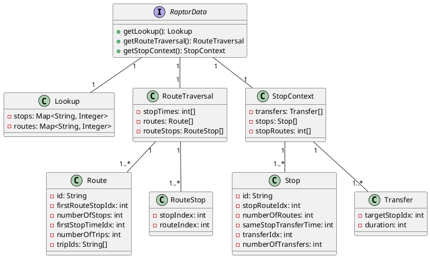
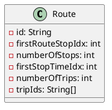

# Simple RAPTOR Implementation

An initial implementation of the RAPTOR algorithm was developed in Java, inspired by the work of Delling et al. [ref],
and included in the early versions of this project (v0.1.0+). This implementation utilized the data structures proposed
in the appendix of their publication.

## RAPTOR Builder

To facilitate the construction of the data structures proposed by Delling et al. [ref], a builder object was created.
This builder allowed the inclusion of all active trips in a schedule for a specific service day. From these active
trips, the relevant routes, stops, stop times, and transfers were derived. After defining all active objects, they were
sorted, and the proposed lookup arrays were instantiated.

*Note: In this early stage of the RAPTOR implementation, only stops served on the specific date for which the RAPTOR was
built were added to the lookup objects. This approach was later modified in our extended implementation to include all
stops.*

## Data Structures

The core data structures were implemented through the `RaptorData` interface, which requires returning three records,
each containing more detailed structures. These data structures were designed with memory locality in mind to enhance
routing performance, allowing efficient cross-referencing by storing indexes to relevant objects in different arrays
rather than keeping collections of object references, which would scatter memory usage.

1. **Lookup:** This record contains two maps that link the ID (type `String`) of a stop or route to the index in the
   corresponding `stops` array (part of `StopContext`) or `routes` array (part of `RouteTraversal`). This setup enables
   quick access to the `Stop` or `Route` objects.

2. **Route Traversal:** This component contains three key data arrays:
    - **Routes:** An array of `Route` objects. The `Route` object serves as a reference point for different arrays to
      facilitate route scanning.
        - **firstRouteStopIdx** & **numberOfStops:** Each route has a fixed sequence of stops. By knowing the first
          index of the `RouteStop` and the number of stops, it’s possible to retrieve all stops in the correct order
          from the `routeStops` array.
        - **firstStopTimeIdx**, **numberOfStops** & **numberOfTrips:** These properties allow looking up specific stop
          times from the `stopTimes` array. Due to the complexity of this array, a more detailed explanation is provided
          in a subsequent section.
        - **tripIds:** A list of `String` IDs for each trip, used primarily to reverse-engineer a meaningful connection
          object after routing.
    - **RouteStops:** An array of `RouteStop` objects. The `RouteStop` object holds the indexes for the
      associated `Stop` and `Route`, representing a stop within a route sequence.
    - **StopTimes:** This is the largest array within the RAPTOR data structure. It contains stop times (arrival and
      departure times in seconds from midnight) for all trips across all routes. A more detailed explanation follows in
      a later section.

3. **Stop Context:**
    - **Stops:** An array of `Stop` objects. Each `Stop` object contains all the necessary information to retrieve
      stop-related data from various arrays.
        - **stopRouteIdx** & **numberOfRoutes:** These allow the retrieval of route indexes passing through a given
          stop.
        - **transferIdx** & **numberOfTransfers:** These allow the retrieval of transfer indexes originating at a stop.
        - **sameStopTransferTime:** The minimum time required to transfer at the same stop. *This feature was not part
          of the original RAPTOR data structures proposed by Delling et al. [ref], but was an early extension we
          introduced to account for same-stop transfers as represented in GTFS data.*
    - **Transfers:** Transfers are specific to a given source stop and only contain information about the transfer
      destination and the time required to reach it (in seconds).
    - **StopRoutes:** An integer array containing all route indexes (as found in the `Routes` array) for each stop. The
      same route index may appear multiple times in this array, with the order defined by the stops. Access to this
      array is facilitated by the `stopRouteIdx` & `numberOfRoutes` properties in the `Stop` object.

### Stop Times Array

As mentioned earlier, the Stop Times array is the largest and most frequently used data structure in the RAPTOR
algorithm. Optimizing this data structure was crucial for performance. For reference, the size of a typical Stop Times
array in a RAPTOR instance derived from a GTFS schedule for Switzerland is approximately 8,000,000 elements, or about 32
MB. While this is a significant amount, it is already highly compact compared to the original GTFS `stop_times.txt`
file, which has a size of around 1,200 MB and essentially contains the same information.

This compactness is achieved primarily by sorting all the information during the `RaptorBuilder` process, thereby
reducing the need for referencing IDs for each stop time. However, the high degree of information compression makes
referencing stop times slightly more complex, which requires further explanation.

{ width="800" }

The Stop Times array consists of pairs of integer values representing the arrival and departure times for a given stop
on a given trip of a given route. In the example shown in the graphic above, Route 1 consists of a sequence of three
stops (Stop 1, Stop 2, and Stop 3). The route is operated 5 times (Trip 1-5), and each trip is represented by three
pairs of arrival/departure times. Other routes may follow Route 1 in the Stop Times array; however, routes are never
mixed inside the array, and trips within a route are always sorted from earliest to latest.

This layout allows efficient scanning of departures from a given stop using the `Route` object, as we can iterate over
all trips.

#### Example

Suppose we are looking for the earliest possible departure from Stop 2 on Route 1 after 8:15 am. Trip 1 departs from
Stop 2 at 07:00 am, Trip 2 at 08:00 am, and Trip 3 at 09:00 am, and so on.

To retrieve the departure time of Trip 1 at Stop 2, the following values are needed:

- **firstStopTimeIdx**: Retrieved from the `Route` object
- **stopOffset**: The (n-1)th stop in the route (for Stop 2, this would be 1)
- **tripOffset**: The (n-1)th trip of the route (for Trip 1, this would be 0)
- **numberOfStops**: Retrieved from the `Route` object (necessary for skipping between trips)

The index in the Stop Times array can then be calculated using the following formula:

`index = firstStopTimeIdx + 2 * (tripOffset * numberOfStops + stopOffset) + 1`

The `2 *` is necessary because the array contains both arrival and departure times for each stop. The `+ 1` is required
because we want to retrieve the departure time, which is the second element of the arrival/departure pair.

When accessing `stopTimes[index]`, this will return 07:00 am. Since we are looking for the earliest departure after 08:
15 am, we know we need to look further into the future. This can be done by incrementing the trip offset by `+1`. The
second lookup will still be too early, but when the trip offset is incremented to `2`, the result will be 09:00 am,
which is the earliest possible departure after 08:15 am.

It is important to note that incrementing the trip offset should only continue while the trip offset is smaller
than `numberOfTrips` to prevent accessing departures from a different route. Typically, this process would be handled
within a `while` loop.
