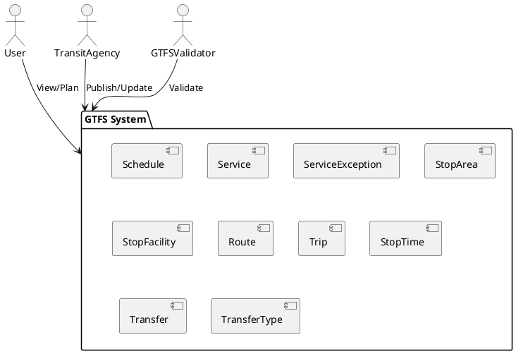

# System Context

```plantuml
@startuml
package "GTFS System" {
  [Schedule]
  [Service]
  [ServiceException]
  [StopArea]
  [StopFacility]
  [Route]
  [Trip]
  [StopTime]
  [Transfer]
  [TransferType]
}

actor User
actor TransitAgency
actor GTFSValidator

User --> "GTFS System" : View/Plan
TransitAgency --> "GTFS System" : Publish/Update
GTFSValidator --> "GTFS System" : Validate
@enduml
```