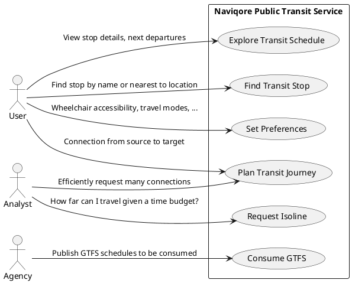

# Use Case

**Users** engage with the Naviqore Public Transit Service to enhance their transit experience. They can explore transit
schedules, locate nearby stops, customize preferences for accessibility and travel modes, and plan optimal routes
between different locations to meet their personal mobility needs.

**Analysts** request large volumes of connections or isolines to conduct analyses related to public
transit and mobility behavior, such as determining how far one can travel within a given time budget, evaluating the
accessibility of a region, and assessing alternative routes available at the time of decision-making.

Transit **agencies** publish GTFS schedules, which are then consumed by the service to provide up-to-date public transit
information and connections.

