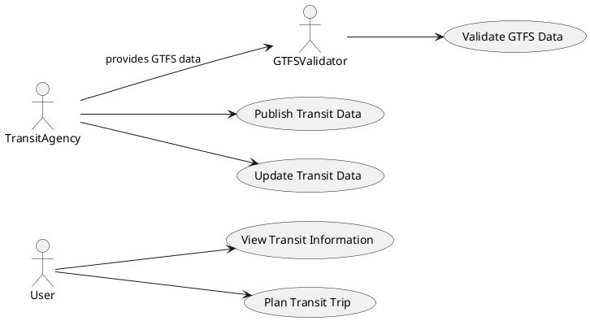
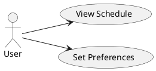
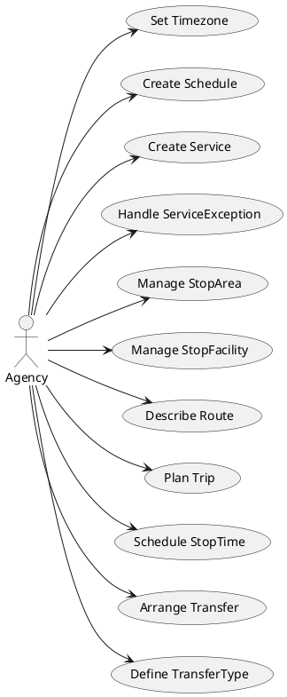

# Use Case

```plantuml
@startuml
left to right direction
actor User
actor TransitAgency
actor GTFSValidator

User --> (View Transit Information)
User --> (Plan Transit Trip)
TransitAgency --> (Publish Transit Data)
TransitAgency --> (Update Transit Data)
GTFSValidator --> (Validate GTFS Data)
TransitAgency --> GTFSValidator : provides GTFS data
@enduml
```

## User Perspective

```plantuml

@startuml
left to right direction
actor User

User --> (View Schedule)
User --> (Set Preferences)
@enduml

```

## Agency Perspective

```plantuml
@startuml
left to right direction
actor Agency

Agency --> (Set Timezone)
Agency --> (Create Schedule)
Agency --> (Create Service)
Agency --> (Handle ServiceException)
Agency --> (Manage StopArea)
Agency --> (Manage StopFacility)
Agency --> (Describe Route)
Agency --> (Plan Trip)
Agency --> (Schedule StopTime)
Agency --> (Arrange Transfer)
Agency --> (Define TransferType)
@enduml
```