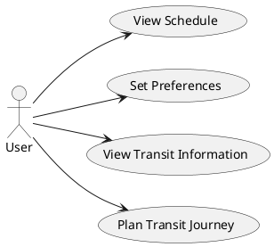
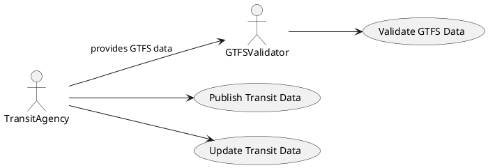

# Use Case

This page provides an overview of the use cases that are relevant in the system context of the Naviqore Public Transit
Service.

## User Perspective

Users interact with the Naviqore Public Transit Service to plan their journeys, view transit schedules, and set
preferences to customize their experience. The following diagram illustrates the primary actions users can take:

## Agency Perspective

Transit agencies are responsible for publishing and updating transit data. The Naviqore Public Transit Service needs to
be able to consume the published data.

