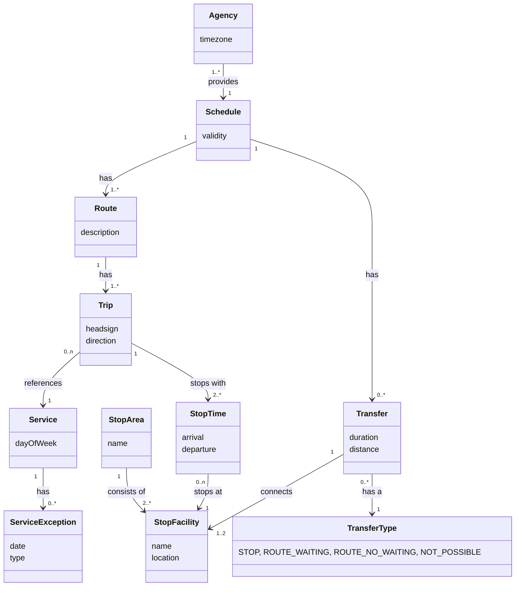

# Domain Model: Agency Perspective

```mermaid
classDiagram
    class Agency {
        timezone
    }
    class Schedule {
        validity
    }
    class Service {
        dayOfWeek
    }
    class ServiceException {
        date
        type
    }
    class StopArea {
        name
    }
    class StopFacility {
        name
        location
    }
    class Route {
        description
    }
    class Trip {
        headsign
        direction
    }
    class StopTime {
        arrival
        departure
    }
    class Transfer {
        duration
        distance
    }
    class TransferType {
        STOP, ROUTE_WAITING, ROUTE_NO_WAITING, NOT_POSSIBLE
    }

    Agency "1..*" --> "1" Schedule: provides
    StopArea "1" --> "2..*" StopFacility: consists of
    Schedule "1" --> "1..*" Route: has
    Schedule "1" --> "0..*" Transfer: has
    Service "1" --> "0..*" ServiceException: has
    Route "1" --> "1..*" Trip: has
    Trip "0..n" --> "1" Service: references
    Trip "1" --> "2..*" StopTime: stops with
    StopTime "0..n" --> "1" StopFacility: stops at
    Transfer "1" --> "1..2" StopFacility: connects
    Transfer "0..*" --> "1" TransferType: has a

```