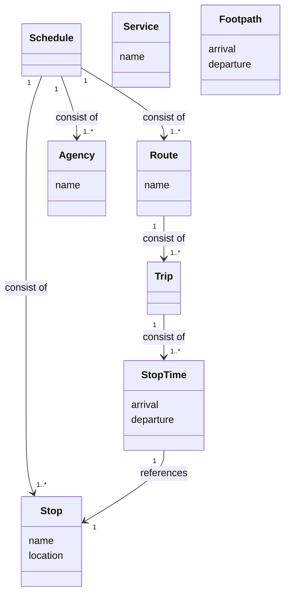

# Domain model

```mermaid
classDiagram
    class Schedule {
        
    }
    class Stop {
        name
        location
    }

    class Route {
        name
    }
    class Trip {
        
    }
    class StopTime {
        arrival
        departure
    }
    class Agency {
        name
    }
    class Service {
        name
    }
    class Footpath {
        arrival
        departure
    }

    Schedule "1" --> "1..*" Agency: consist of
    Schedule "1" --> "1..*" Route: consist of
    Schedule "1" --> "1..*" Stop: consist of
    Route "1" --> "1..*" Trip: consist of
    Trip "1" --> "1..*" StopTime: consist of
    StopTime "1" --> "1" Stop: references

    

```