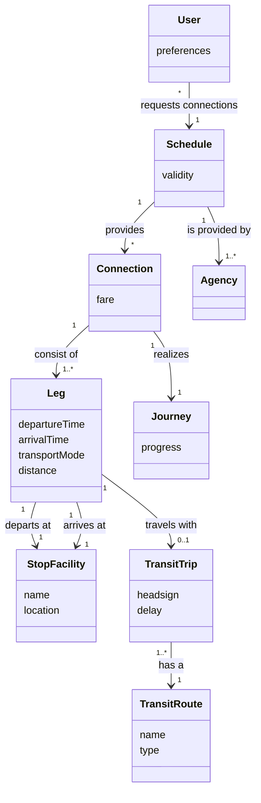

# Domain model: User Perspective

```mermaid
classDiagram
    class Schedule {
        validity
    }
    class User {
        preferences
    }
    class Connection {
        fare
    }
    class StopFacility {
        name
        location
    }
    class Leg {
        departureTime
        arrivalTime
        transportMode
        distance
    }
    class Journey {
        progress
    }
    class TransitRoute {
        name
        type
    }
    class TransitTrip {
        headsign
        delay
    }

    Schedule "1" --> "1..*" Agency: is provided by
    User "*" --> "1" Schedule: requests connections
    Schedule "1" --> "*" Connection: provides
    Connection "1" --> "1" Journey: realizes
    Connection "1" --> "1..*" Leg: consist of
    Leg "1" --> "1" StopFacility: departs at
    Leg "1" --> "1" StopFacility: arrives at
    Leg "1" --> "0..1" TransitTrip: travels with
    TransitTrip "1..*" --> "1" TransitRoute: has a


```